<!-- 该报告由张子炜于2025年04月30日自Wind金融终端下载，仅供内部使用，请勿传阅 -->

<!-- ziweizhang@suibe.edu.cn -->

<!-- 2025年04月07日 -->

<!-- 西南证券 SOUTHWEST SECURITIES -->

<!-- 证券研究报告·金融工程专题报告 -->

<!-- 机器学习应用系列 -->

# PINN信息约束与时序截面双流网络选股模型

# 摘要

**·本文构建了一种融合时序特征提取、图结构关联与宏观状态约束的多模态深度**学习选股框架。首先，通过Transformer编码器捕捉个股量价数据的长期时序依赖，提取自适应时间戳特征；其次，基于图注意力网络（GAT）构建行业关联图与资金流向图，解析行业拓扑结构中的非线性关联与资金交互网络中的传导效应；最后，引入物理信息神经网络（PINN)，将宏观经济状态方程作为软约束嵌入模型，实现宏观信息对个股收益预测的信息映射。

**·多尺度 Transformer 模型（Multi-Transformer）。本文基于个股基本量价信息**构建出14个时序量价特征，在20日、40日及80日的尺度下，分别利用Transformer 进行时序信息处理，并引入门控融合层对三个不同尺度的信息进行加权融合。经回测，Multi-Transformer模型月IC均值10.95%，多头组合年化收益率为32.88%，月均单边换手率0.83X,10分组回测下因子多头组合表现并不显著，且除空头组合外，其余组合分化程度不高，Transformer 模型及量价时序信息在因子挖掘效果层面更多聚焦于空头，具备进一步提升空间。

**·个股关联GAT模型（indcap-GAT）。本文从行业关联及资金流向两个角度进**行个股关联信息的挖掘。首先基于申万一级行业分类构建行业关联图，并在行业关联的基础上额外构建跨行业边；其次基于部分资金流特征相似性构建资金流向相似边，从而构建资金图，随后两者经过GAT模型处。经模型回测，indcap-GAT因子月均IC为8.77%，多头组合年化收益率为32.77%，月均单边换手率0.61X，整体来看，仅靠个股关联信息训练出的indcap-GAT模型具备一定的选股效果，因子换手相较Multi-Transformer有显著的降低。

**·宏观状态方程构建与损失约束**：本文从货币状态以及利率调节状态等角度构建了关于宏观状态虚拟变量的宏观状态方程。并引入PINN（物理信息神经网络）损失函数中物理损失项，在最终的时序截面双流网络模型中引入了宏观状态损失约束。经过回测，PINN宏观信息约束下的时序截面双流网络模型（PINN-MTICG）因子月平均IC为11.41%，多头组合年化收益37.51%，月均单边换手率0.83X，因子表现相较于单独信息输入的 Multi-Transformer与indcap-GAT模型均有所提升。且分组回测下，PINN-MTICG因子多空年化收益率44.67%，因子分组效果有所改善。

**·指数增强策略：PINN-MTICG** 模型沪深300指数增强策略年化超额收益率13.22%，近一个月、三个月、一年、三年超额收益率分别为5.53％、4.15％、24.56％以及8.83%;PINN-MTICG 模型中证1000指数增强策略年化超额收益率16.96%，近一个月、三个月、一年、三年超额收益率分别为0.84％、3.59％、23.38％以及18.75％。

**·风险提示：**报告对应的相关结论完全基于公开的历史数据进行算法构建、统计以及计算，文中部分数据有一定滞后性，同时也存在第三方数据提供不准确或者缺失等风险；策略效果结论仅针对于回测区间得出，并不预示其未来表现，也不能保证未来的可持续性，亦不构成投资收益的保证或投资建议。

# 西南证券研究院

分析师：郑琳琳

执业证号：S1250522110001

邮箱：zhengll@swsc.com.cn

联系人：祝晨宇

邮箱：zhcy@swsc.com.cn

# 相关研究

1．基于产业链和交易结构的豆粕期货择时框架（2025-03-19）

2．可转债K线技术分析与K线形态因子一一量化方法在债券研究中的应用三(2025-03-14)

3．识时通变：宏微同频成长价值风格轮动策略（2025-01-10）

4．超额收益如何回归？-2025年金融工程策略报告（2025-01-06）

5.ESG投资概述及其在多因子策略中的应用（2024-12-11）

6．价格形成路径与趋势清晰度因子(2024-11-08)

7．基于优选“固收＋”基金探索绝对收益策略构建之“道”（2024-11-08）

8．基于历史相似走势的因子选股研究(2024-09-09)

9．如何利用机器学习赋能红利高股息投资（2024-08-05）

10．量价时序特征挖掘模型在深度学习因子中的应用（2024-07-11）

<!-- 请务必阅读正文后的重要声明部分 -->

<!-- 该报告由张子炜于2025年04月30日自Wind金融终端下载，仅供内部使用，请勿传阅 -->

<!-- ziweizhang@suibe.edu.cn -->

<!-- 西南证券 SOUTHWEST SECURITIES -->

<!-- 机器学习应用系列 -->

# 目录

**1深度学习模型简介**.................................................................................1

1.1 TransFormer 模型...............................................................................1

1.2图注意力网络（GAT）模型.......................................................................3

1.3物理信息神经网络（PINN）模型..................................................................5

**2时序模型：多尺度TransFormer模型**..................................................................**6**

2.1多尺度Transformer模型设定.....................................................................6

2.2多尺度Transformer时序模型回测效果.............................................................8

**3 截面模型：基于行业关联图与资金流向图的GAT模型**..................................................**10**

3.1行业关联图与资金流向图的构建.................................................................10

3.2基于行业关联图与资金流向图的GAT模型回测结果.................................................12

**4 PINN神经网络宏观信息约束**........................................................................**15**

4.1宏观状态定义及宏观状态方程构建...............................................................15

4.2 PINN神经网络及选股模型约束...................................................................16

4.3 PINN宏观信息约束的时序截面双流模型测试.......................................................17

**5模型回测及指数增强策略．**..........................................................................20

5.1沪深300指数增强策略.........................................................................20

5.2中证1000指数增强策略．........................................................................22

**6 总结与展望．**......................................................................................25

**7 风险提示**........................................................................................25

<!-- 请务必阅读正文后的重要声明部分 -->

<!-- 该报告由张子炜于2025年04月30日自Wind金融终端下载，仅供内部使用，请勿传阅 -->

<!-- ziweizhang@suibe.edu.cn -->

<!-- 西南证券 SOUTHWEST SECURITIES -->

<!-- 机器学习应用系列 -->

# 图目录

图1:PINN信息约束与时序截面双流网络结构图..........................................................1

图2:TransFormer 网络结构．............................................................................2

图3：图注意力机制示意..............................................................................5

图4：节点信息聚合过程..............................................................................5

图5:PINN网络结构..................................................................................6

图6：时序编码模块架构：多尺度TransFormer............................................................7

图7：多尺度Transformer 因子IC．.......................................................................8

图8：多尺度Transformer因子分组-绝对净值.............................................................8

图9：多尺度TransFormer因子分组测试-相对净值.........................................................9

图10：多尺度Transformer因子多头分年度净值．..........................................................10

图11:GAT个股关联信息编码结构.....................................................................12

图12:Indcap-GAT因子IC．............................................................................13

图13:Indcap-GAT因子分组-绝对净值..................................................................13

图14:indcap-GAT因子分组测试-相对净值..............................................................14

图15:indcap-GAT因子多头分年度净值.................................................................14

图16:MTICG因子IC．................................................................................18

图17:PINN-MTICG因子IC．...........................................................................18

图18:MTICG因子分组测试-绝对净值..................................................................18

图19:PINN-MTICG因子分组测试-绝对净值.............................................................18

图20:MTICG因子分组测试-相对净值..................................................................19

图21:PINN-MTICG因子分组测试-相对净值.............................................................19

图22:MTICG因子分组测试-相对净值..................................................................19

图23:PINN-MTICG因子分组测试-相对净值.............................................................19

图24:MTICG沪深300指数增强表现..................................................................21

图25:MTICG沪深300指数增强相对净值...............................................................21

图26:PINN-MTICG沪深300指数增强表现..............................................................21

图27:PINN-MTICG沪深300指数增强相对净值．..........................................................21

图28:PINN-MTICG沪深300指数增强表现（近一月）.....................................................22

图29:PINN-MTICG沪深300指数增强表现（近三月）.....................................................22

图30:PINN-MTICG沪深300指数增强表现（近一年）.....................................................22

图31:PINN-MTICG沪深300指数增强表现（近三年）.....................................................22

图32:MTICG中证1000指数增强表现.................................................................23

图33:MTICG中证1000指数增强相对净值.............................................................23

图34:PINN-MTICG中证1000指数增强表现.............................................................23

图35:PINN-MTICG中证1000指数增强相对净值.........................................................23

图36:PINN-MTICG中证1000指数增强表现（近一月）....................................................24

图37:PINN-MTICG中证1000指数增强表现（近三月）....................................................24

图38:PINN-MTICG中证1000指数增强表现（近一年）....................................................24

图39:PINN-MTICG中证1000指数增强表现（近三年）....................................................24

<!-- 请务必阅读正文后的重要声明部分 -->

<!-- 该报告由张子炜于2025年04月30日自Wind金融终端下载，仅供内部使用，请勿传阅 -->

<!-- ziweizhang@suibe.edu.cn -->

<!-- 西南证券 SOUTHWEST SECURITIES -->

<!-- 机器学习应用系列 -->

# 表目录

表1:Multi-Transformer模型量价时序特征列表............................................................7

表2:Multi-Transformer 回测结果........................................................................8

表3：多尺度Transformer 因子10分组表现...............................................................9

表4：多尺度Transformer因子多头分年度超额表现.......................................................10

表5：行业关联图及资金流向图构建特征................................................................11

表6:Indcap-GAT因子回测结果........................................................................12

表7:indcap-GAT因子分组表现........................................................................13

表8:indcap-GAT因子多头分年度超额表现..............................................................14

表9：全A范围内因子测试............................................................................17

表10:PINN-MTICG与MTICG模型分年度超额表现........................................................19

表11：沪深300指数成分股因子测试...................................................................20

表12：沪深300指数增强策略回测结果.................................................................20

表13:PINN-MTICG沪深300指数增强策略分区间回测结果．................................................21

表14：中证1000指数成分股因子测试..................................................................22

表15：中证1000指数增强策略回测结果................................................................23

表16:PINN-MTICG中证1000指数增强策略分区间回测结果...............................................24

<!-- 请务必阅读正文后的重要声明部分 -->

<!-- 该报告由张子炜于2025年04月30日自Wind金融终端下载，仅供内部使用，请勿传阅 -->

<!-- ziweizhang@suibe.edu.cn -->

<!-- 西南证券 SOUTHWEST SECURITIES -->

<!-- **机器学习应用系列** -->

# 1 深度学习模型简介

深度学习模型中，传统的时序预测模型（如ARIMA、LSTM）虽在局部特征捕捉上表现尚可，但在处理跨周期依赖、市场异质性以及多源信息融合等问题时仍存在显著局限。此外，传统时序模型在训练过程中仅专注于个股特异性特征学习，绝大部分重心集中在内部驱动因素的学习，很难考虑到个股之间相互影响，以及宏观中观经济因素的外部影响。

基于“个股特异内部特征＋个股关联中观特征＋宏观信息”的多维度特征挖掘原则，本报告的核心方法论围绕三大主线展开：

首先，基于Transformer的时序特征编码器对股票价格、交易量等高频序列进行多尺度特征提取，通过多头注意力机制动态捕捉不同时间窗口下的个股内部状态的演变规律；

其次，利用截面维度下的行业属性、财务指标及市资金流特征构建行业关联图及资金流向图，并引入图注意力网络（GAT）建模股票间的非线性关联与风险传导路径，从而将传统投资组合理论中的“分散化”原则转化为可量化的图结构学习问题；

最后，针对宏观因素（如利率、社融等）与传统深度学习模型融合困难的问题，引入物理信息神经网络（PINN)，通过构建带有经济约束的偏微分方程框架，将宏观变量的连续演化规律嵌入个股因子挖掘模型，实现“自上而下”与“自下而上”的结合。

**图1:PINN信息约束与时序截面双流网络结构图**

<!-- image_content_description_start -->
本图展示了基于PINN信息约束的时序与截面双流网络结构，描述了特征提取、模型编码到个股收益预测的完整流程。
<!-- image_content_description_end -->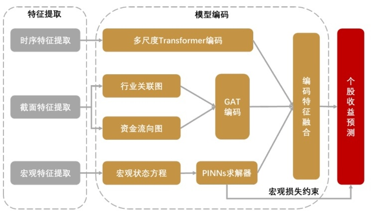

数据来源：西南证券整理

## 1.1 TransFormer 模型

Transformer 是一种基于自注意力机制（Self-Attention）的深度学习模型，最初被提出用于自然语言处理领域，但其在时序数据处理中同样展现出强大的能力。相较于LSTM(Long Short-Term Memory),GRU(Gated Recurrent Unit）等循环神经网络，Transformer摒弃了递归结构，转而通过自注意力机制实现了全序列并行计算，这显著提升了训练速度。

<!-- 请务必阅读正文后的重要声明部分 1 -->

<!-- 该报告由张子炜于2025年04月30日自Wind金融终端下载，仅供内部使用，请勿传阅 -->

<!-- ziweizhang@suibe.edu.cn -->

<!-- 西南证券 SOUTHWEST SECURITIES -->

<!-- **机器学习应用系列** -->

此外，尽管LSTM和GRU通过门控机制缓解了梯度消失问题，但在超长序列中，这两个模型仍可能丢失早期信息；而Transformer的自注意力机制则直接建模模型中任意位置间的关联，无需依赖递归路径，因此相较于LSTM与GRU，更擅长捕捉跨周期的时序规律。

**图2:TransFormer 网络结构**

<!-- image_content_description_start -->
The diagram illustrates the architecture of the Transformer network, detailing both the encoder and decoder structures and the flow of information through embedding, positional encoding, multi-head attention, feed-forward layers, and output probability computation.
<!-- image_content_description_end -->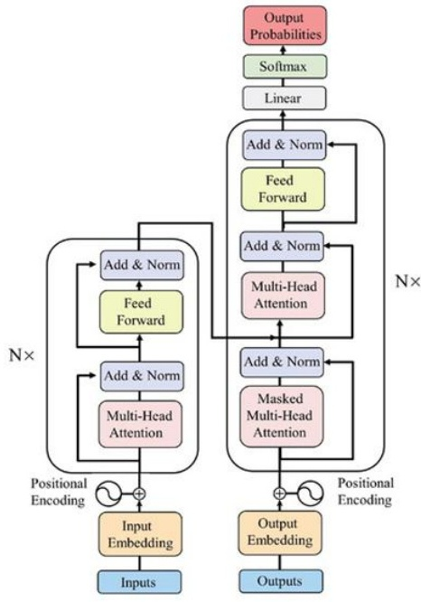

数据来源：西南证券整理

Transformer的核心模块包括多头自注意力层（Multi-Head Attention）和前馈神经网络（Feed-Forward Network）。其输入序列首先通过嵌入层转换为向量表示，并加入位置编码（Positional Encoding）以保留时序信息。自注意力机制通过计算序列中每个元素与其他元素的相关性权重，动态调整信息聚合方式。具体计算过程如下：

### （1）自注意力计算

给定输入矩阵 $X$ ，通过线性变换生成查询（Query）、键(Key)、值（Value）矩阵：

$$Q=XW_{Q},K=XW_{K},\quad V=XW_{V}$$

其中 $W_{Q},W_{K},$  $W_{V}$ 分别代表查询（Query）、键（Key）、值（Value）矩阵对应的线性变换矩阵。此外，通过点积 $Q$ ,K计算注意力得分，进而得到自注意力值Z：

$$Z=\text {Attention}(Q,K,V)=\text {softmax}\left(\frac {QK^{T}}{\sqrt {d_{k}}}\right)V$$

<!-- 请务必阅读正文后的重要声明部分 2 -->

<!-- 该报告由张子炜于2025年04月30日自Wind金融终端下载，仅供内部使用，请勿传阅 -->

<!-- ziweizhang@suibe.edu.cn -->

<!-- 西南证券 SOUTHWEST SECURITIES -->

<!-- **机器学习应用系列** -->

其中 $d_{k}$ 为键向量的维度，用于防止梯度消失，softmax函数将一组数值转换为概率分布（总和为1)，放大高分值的相对权重，从而实现注意力得分的归一化。

除了上述提及的简单的自注意力计算外，有时也会使用多头注意力机制，即在构建Transformer模型时也会将Q,K,V分割为多个子空间并行计算，从而得到数个注意力头 $z_{i}$ 并拼接，最后通过线性变换矩阵，将拼接结果变换为一个融合了所有注意力头信息的矩阵 $z$ ：

$$z=\text {Multihead}(Q,K,V)=\text {Concat}\left(z_{1},\cdots \cdots ,z_{h}\right)W_{0}$$

其中，每个注意力头 $z_{i}$ 独立学习不同子空间的特征表示， $W_{O}$ 表示融合后的线性变换矩阵。

### （2）多头注意力

将Q,K,V分割为多个子空间并行计算，最后拼接结果并通过线性层融合：

$$Multihead\;\left(Q\;,\;K\;,\;V\right)=Concat\left(head_{1}\;,\;\ldots \ldots \;,\;head_{h}\right)W_{o}$$

每个注意力头独立学习不同子空间的特征表示。其中， $W_{O}$ 是融合后的线性变换矩阵。

### （3）前馈网络与残差连接

自注意力输出经过前馈网络（含ReLU 激活）和层归一化（LayerNorm)，并通过残差连接缓解梯度消失问题。算式如下，其中，Sublayer(x）指当前子层（自注意力层或前馈层）输出（如前述提及的z）

$$Output=LayerNorm\left(x+Sublayer(x)\right)$$

上述提及的ReLU函数可以通过将负输入置零并保留正输入，提升网格的稀疏性与泛化能力，并促进计算高效性，其算式如下：

$$\text {ReLU}(x)=\max (0,x)$$

## 1.2图注意力网络（GAT）模型

图注意力网络（Graph Attention Network,GAT）是一种基于图结构的深度学习模型。相较于传统的GCN网络，GAT引入了动态的注意力学习机制，可以在学习过程中自适应的调整节点间的影响强度，从而捕捉特征间非显性的相关关系。此外，共享注意力矩阵的设计及动态的权重分配方式使得GAT模型能处理节点与边关系动态变化的图模型，从而更好适应股票市场中不断变化的个股关系，并实现对新增个股的预测。

GAT的核心是通过注意力系数聚合邻居节点信息。对于节点i和其邻居j，注意力系数计算如下：

<!-- 请务必阅读正文后的重要声明部分 3 -->

<!-- 该报告由张子炜于2025年04月30日自Wind金融终端下载，仅供内部使用，请勿传阅 -->

<!-- ziweizhang@suibe.edu.cn -->

<!-- 西南证券 SOUTHWEST SECURITIES -->

<!-- **机器学习应用系列** -->

### （1）特征变换

对节点特征 $h_{i}$  $h_{j}$ 进行线性变换：

$$\widetilde {h_{ι}}=Wh_{i}\quad ,\;\widetilde {h_{J}}=Wh_{j}$$

其中， $h_{i}$ 和 $\mathrm {h}_{\mathrm {j}}$ 是节点特征向量，W是一个共享参数矩阵，其效果为对节点特征向量进行增维处理，从而实现特征增强； $\widetilde {\mathrm {h}_{1}}和\widetilde {\mathrm {h}_{1}}$ 则是变换后的节点特征向量。

### （2）注意力得分

使用共享参数 $a$ 计算节点对的注意力得分，并通过 $LeakyReLU$  激活：

$$e_{ij}=\text {LeakyReLU}\left(a^{T}\left[\widetilde {h_{ι}}\\ vert\widetilde {h_{J}}\right]\right)$$

上述公式将两个维度为 $(n,1)$  的列向量拼接形成（ $(2n,1)$  的高维向量，而共享参数向量a则进一步将拼接后的高维特征映射到一个实数上，从而得到初步的注意力得分。LeakyReLU 函数的效果则是在ReLU函数的基础上，对负值输入赋予微小斜率（如0.01)，避免神经元“死亡”，缓解梯度消失问题，同时保持非线性表达能力，其具体表达式如下：

$$\text {LeakyReLU}(\mathrm {x})=\left\{\begin{array}{l}\mathrm {x}\text {if}\mathrm {x}\geq 0\\ \mathrm {a}\mathrm {x}\text {if}\mathrm {x}<0\end{array}\right.$$

### （3）归一化权重

对邻居节点的注意力得分进行softmax归一化：

$$α_{ij}=\frac {\exp \left(e_{ij}\right)}{\sum _{k\in N(i)}\exp \left(e_{ik}\right)}$$

其中， $N(i)$ 是节点i的所有邻居居节点组成的集合。通过将节点i所有邻居节点的 $\mathrm {e}_{\mathrm {ij}}$ 输入softmax函数，我们实现了其所有邻居节点间注意力得分的归一化，从而得到了最终的注意力系数。

### （4）特征聚合

加权求和邻居节点特征作为当前节点的新表示：

$$\dot {h_{ι}}=\sigma \left(\sum _{j\in N(i)}\alpha _{ij}\widetilde {h_{J}}\right)$$

其中， $0$ 表示激活函数，而 $\mathrm {h}_{1}$ 就是节点i的融合了其邻域信息的新特征，至此便完成了一轮节点特征的计算。

<!-- 请务必阅读正文后的重要声明部分 4 -->

<!-- 该报告由张子炜于2025年04月30日自Wind金融终端下载，仅供内部使用，请勿传阅 -->

<!-- ziweizhang@suibe.edu.cn -->

<!-- 西南证券 SOUTHWEST SECURITIES -->

<!-- 机器学习应用系列 -->

**图3：图注意力机制示意**

<!-- image_content_description_start -->
This diagram visually illustrates the mechanism of graph attention, showing how node features are aggregated using attention coefficients computed via a softmax function.
<!-- image_content_description_end -->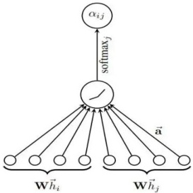

数据来源：西南证券整理

**图4：节点信息聚合过程**

<!-- image_content_description_start -->
本图展示了节点 h₁ 从其邻居节点 h₂、h₃、h₄、h₅、h₆ 聚合信息的过程，并通过 concat/avg 得到新的节点表示 h'₁。
<!-- image_content_description_end -->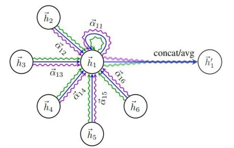

数据来源：西南证券整理

## 1.3物理信息神经网络（PINN）模型

物理信息神经网络（Physics-Informed Neural Networks,PINNs）通过将物理定律（如市场均衡方程、波动率模型）嵌入损失函数，增强模型对金融动力学规律的拟合能力，适用于衍生品定价、风险因子挖掘等场景。PINNs的损失函数包含数据拟合项和物理约束项：

### （1）数据驱动损失

监督模型输出与历史数据的误差：

$$L_{data}=\frac {1}{N}\sum _{i=1}^{N}\\ verty_{i}-\widehat {y_{i}}\\ vert^{2}$$

其中 $y_{i}$ 表示实际值， $\widehat {y_{l}}$ 表示模型预测值

### （2）物理约束损失

强制模型满足偏微分方程（如Black-Scholes 方程）：

$$L_{\text {physics}}=\frac{1}{M}\sum_{j=1}^{M}\left\|P\left(\widehat{y}_{J},t_{j},x_{j}\right)\right\|^{2}$$

其中 $P$ 为物理方程残差， $t_{j},x_{j}$ 为模型输入参数。

**（3）总损失**

$$L=\lambda L_{data}+(1-\lambda )L_{physics}$$

<!-- 请务必阅读正文后的重要声明部分 5 -->

<!-- 该报告由张子炜于2025年04月30日自Wind金融终端下载，仅供内部使用，请勿传阅 -->

<!-- ziweizhang@suibe.edu.cn -->

<!-- 西南证券 SOUTHWEST SECURITIES -->

<!-- 机器学习应用系列 -->

**图5:PINN网络结构**

<!-- image_content_description_start -->
This diagram illustrates the structure of a Physics-Informed Neural Network (PINN), showing the flow from input layers through hidden layers to output layers, and how optimization is performed using both neural network loss and physics loss, with physics information incorporated via derivatives.
<!-- image_content_description_end -->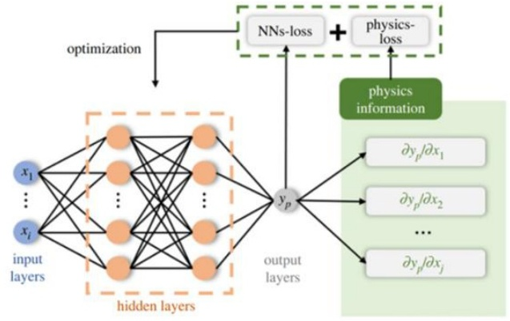

数据来源：西南证券整理

# 2时序模型：多尺度TransFormer模型

个股量价时序特征是可以我们可以获取到相较高频的个股特征数据，而本文主要采用Transformer模型处理该类时序特征，Transformer模型的自注意力机制使得其能够在不依赖传统循环神经网络（RNN）结构的情况下，高效捕捉长时序数据中的依赖关系，且具有更强的并行计算能力。

同时，个股时序特征的时序长短设定同样影响最终因子挖掘的效果，为了兼顾长短不同周期的时序变化信息，本文提出了多尺度Transformer(Multi-Scale Transformer）模型。该模型的构造逻辑在于，通过引入不同的尺度对输入时序数据进行处理，能够在不同时间粒度下捕捉股市信息的多层次特征。具体而言，我们将原始的时序数据在多个时间窗口下进行划分，每个时间尺度下的特征都通过独立的Transformer模块进行处理，并对编码后的不同时序周期特征进行融合，以实现模型纳入不同时序周期信息的，捕捉到个股在不同时间段内的短期和长期趋势。

## 2.1多尺度Transformer模型设定

本文根据个股日频量价数据构建出14个量价时序特征用以多尺度 Transformer模型编码，具体特征计算方式及特征设定如下：

<!-- 请务必阅读正文后的重要声明部分 6 -->

<!-- 该报告由张子炜于2025年04月30日自Wind金融终端下载，仅供内部使用，请勿传阅 -->

<!-- ziweizhang@suibe.edu.cn -->

<!-- 西南证券 SOUTHWEST SECURITIES -->

<!-- 机器学习应用系列 -->

**表1:Multi-Transformer模型量价时序特征列表**

<table border="1" ><tr>
<td>序号</td>
<td>特征中文名称</td>
<td>特征助记符</td>
<td>特征计算方法</td>
</tr><tr>
<td>1</td>
<td>量价背离度</td>
<td>pvo</td>
<td>T 收盘价减去收盘价的5 日指数移动平均值后，除以成交量的20 日移动平均值</td>
</tr><tr>
<td>2</td>
<td>压力支撑效率</td>
<td>sse</td>
<td>过去20 日最高收盘价减去过去20 日最低收盘价后，除以成交量的20 日移动平均值</td>
</tr><tr>
<td>3</td>
<td>流动性冲击系数</td>
<td>liq</td>
<td>T 成交量与昨日成交量差值的绝对值，除以过去20 日内成交量序列的标准差</td>
</tr><tr>
<td>4</td>
<td>波动率偏度</td>
<td>skew</td>
<td>T 日收益率过去20 日内的三阶标准化矩</td>
</tr><tr>
<td>5</td>
<td>隔夜跳空强度</td>
<td>gap</td>
<td>T 开盘价减去昨日收盘价，再除以T -1 收盘价</td>
</tr><tr>
<td>6</td>
<td>波动率期限结构</td>
<td>vts</td>
<td>过去10 日内日收益率序列的标准差除以过去30 日内日收益率序列的标准差</td>
</tr><tr>
<td>7</td>
<td>量能聚集度</td>
<td>vcll</td>
<td>T 成交量除以过去20 日内成交量的移动平均值</td>
</tr><tr>
<td>8</td>
<td>收益率波动比</td>
<td>rvr</td>
<td>T 收益率除以过去20 日序列日收益率标准差</td>
</tr><tr>
<td>9</td>
<td>筹码松动度</td>
<td>csl</td>
<td>T 收盘价减去过去60 日收盘价的移动平均值后，除过去60 日收盘价的移动平均值</td>
</tr><tr>
<td>10</td>
<td>反转效应强度</td>
<td>rev</td>
<td>过去20 日序列中，当日收益率与昨日的日收益率的相关系数</td>
</tr><tr>
<td>11</td>
<td>波动率聚集度</td>
<td>vclb</td>
<td>过去5 日内日收益率序列的标准差除以过去20 日内日收益率序列的标准差</td>
</tr><tr>
<td>12</td>
<td>收益分布峰度</td>
<td>kurtosis</td>
<td>日收益率过去20 日内的四阶标准化矩</td>
</tr><tr>
<td>13</td>
<td>流动性冲击持续性</td>
<td>lip</td>
<td>进三日流动性冲击系数加权求和</td>
</tr><tr>
<td>14</td>
<td>市场宽度指标</td>
<td>bread</td>
<td>当日上涨股票数减去当日下跌股票数，除以总股票数</td>
</tr><tr>
<td colspan="4">数据来源：西南证券整理</td>
</tr></table>

模型训练方式等其他模型设定如下：

1）训练数据：上表内的14个股票时序量价特征，所有个股过去8年内的时序特征，做5天采样，预测标签为未来一个月的累计收益；

2）训练集验证集比例：80%:20%；

3）多时序尺度选择：20天、40天、80天

4）数据处理：时序标准化（各特征除最后一个时间步），截面标准化（均值标准差）。

5）模型训练及调仓频次：一年更新，月频调仓。

**6）模型超参数**： $batch=截面个股数$ ， $\text {Ir}=1\mathrm {e}-4,$ ，损失函数1-IC

**图6：时序编码模块架构：多尺度TransFormer**

<!-- image_content_description_start -->
本图展示了多尺度Transformer时序编码模块的结构流程，包括三种不同时间尺度（20日、40日、80日）的特征提取与融合过程。
<!-- image_content_description_end -->

数据来源：西南证券整理

<!-- 请务必阅读正文后的重要声明部分 7 -->

<!-- 该报告由张子炜于2025年04月30日自Wind金融终端下载，仅供内部使用，请勿传阅 -->

<!-- ziweizhang@suibe.edu.cn -->

<!-- 西南证券 SOUTHWEST SECURITIES -->

<!-- **机器学习应用系列** -->

在多尺度Transformer模型构建中，本文主要区分为三个尺度：20日、40日以及80日，分别表征短、中、长三个不同跨度的时序信息，并分别使用transformer层进行编码处理，随后对transformer层输出的信息以80日长度为基准进行线性时间序列上采样，并引入可学习参数的门控融合层对三个不同时间尺度的信息进行加权求和，最终引入全连接层输出收益率预测。

## 2.2多尺度Transformer时序模型回测效果

在本节中，本文主要测试了依托于量价信息构造的时序模型Transformer的选股因子效果。自2019年1月至2025年2月，全A范围内多尺度Transformer(Multiscale-TransFormer）因子月均IC（以RanklC表征）为10.98%，多头组合年化收益率为32.90%，月均单边换手率0.83X，整体来看，仅靠量价时序特征训练出的Transformer模型具备一定的选股效果。

**表2:Multi-Transformer 回测结果**

<table border="1" ><tr>
<td></td>
<td>IC</td>
<td>ICIR</td>
<td>Top10 ％组合年化收益率</td>
<td>年化波动</td>
<td>信息比率</td>
<td>最大回撤率</td>
<td>单边月均换手率</td>
</tr><tr>
<td>Multi-Transformer</td>
<td>10.95%</td>
<td>3.42</td>
<td>32.88%</td>
<td>23.38%</td>
<td>1.41</td>
<td>27.59%</td>
<td>0.83</td>
</tr></table>

数据来源：wind、恒生聚源、ifind、西南证券整理，截至2025年3月31日

从分组角度来看，多头组合（组1）年化收益率32.88%，最大回撤27.59%；空头组合（组10）年化收益率-6.31%，最大回撤69.60%；多空组合（组1／组10）年化收益率41.81%，最大回撤17.88%，具备一定单调性。但整体来看，因子多头组合表现并不显著，且除空头组合外，其余组合分化程度不高，Transformer 模型及量价时序信息在因子挖掘效果层面更多聚焦于空头，具备进一步提升空间。

**图7：多尺度Transformer 因子IC**

<!-- image_content_description_start -->
This chart displays the multi-scale Transformer factor IC over time, with monthly bar values for "RankIC" and a cumulative line for "累计RankIC(右)", illustrating the performance and trend of the factor from January 2019 to March 2025.
<!-- image_content_description_end -->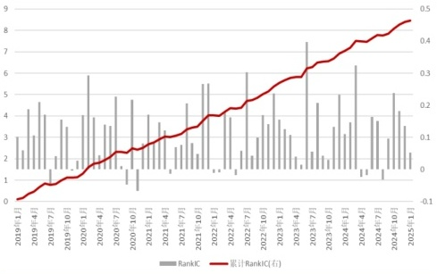

数据来源：wind、ifind、西南证券整理，截至2025年3月31日

**图8：多尺度Transformer因子分组-绝对净值**

<!-- image_content_description_start -->
本图展示了多尺度Transformer因子分组的绝对净值随时间的变化，分为Group1至Group10十个分组，并与基准进行对比。
<!-- image_content_description_end -->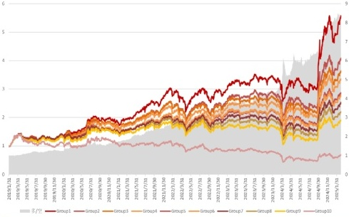

数据来源：wind、ifind、西南证券整理，截至2025年3月31日

<!-- 请务必阅读正文后的重要声明部分 8 -->

<!-- 该报告由张子炜于2025年04月30日自Wind金融终端下载，仅供内部使用，请勿传阅 -->

<!-- ziweizhang@suibe.edu.cn -->

<!-- 西南证券 SOUTHWEST SECURITIES -->

<!-- 机器学习应用系列 -->

**表3：多尺度Transformer 因子10分组表现**

<table border="1" ><tr>
<td></td>
<td>年化收益率</td>
<td>年化波动</td>
<td>信息比率</td>
<td>最大回撤率</td>
</tr><tr>
<td>多／空</td>
<td>41.81%</td>
<td>16.09%</td>
<td>2.59</td>
<td>16.28%</td>
</tr><tr>
<td>Group1</td>
<td>32.88%</td>
<td>23.38%</td>
<td>1.41</td>
<td>27.59%</td>
</tr><tr>
<td>Group2</td>
<td>26.23%</td>
<td>23.51%</td>
<td>1.12</td>
<td>31.74%</td>
</tr><tr>
<td>Group3</td>
<td>23.85%</td>
<td>23.81%</td>
<td>1.00</td>
<td>33.25%</td>
</tr><tr>
<td>Group4</td>
<td>22.23%</td>
<td>24.22%</td>
<td>0.92</td>
<td>34.27%</td>
</tr><tr>
<td>Group5</td>
<td>19.13%</td>
<td>24.50%</td>
<td>0.78</td>
<td>35.49%</td>
</tr><tr>
<td>Group6</td>
<td>18.49%</td>
<td>25.07%</td>
<td>0.74</td>
<td>37.62%</td>
</tr><tr>
<td>Group7</td>
<td>16.64%</td>
<td>25.21%</td>
<td>0.66</td>
<td>37.70%</td>
</tr><tr>
<td>Group8</td>
<td>13.97%</td>
<td>25.82%</td>
<td>0.54</td>
<td>39.79%</td>
</tr><tr>
<td>Group9</td>
<td>11.29%</td>
<td>26.51%</td>
<td>0.43</td>
<td>45.19%</td>
</tr><tr>
<td>Group10</td>
<td>-6.31%</td>
<td>29.25%</td>
<td>-0.21</td>
<td>69.60%</td>
</tr></table>

数据来源：wind、恒生聚源、ifind、西南证券整理，截至2025年3月31日

**图9：多尺度TransFormer 因子分组测试-相对净值**

<!-- image_content_description_start -->
The chart displays the relative net value performance over time for ten different factor groups derived from a multi-scale Transformer model, covering the period from 2019/01/31 to 2025/03/31.
<!-- image_content_description_end -->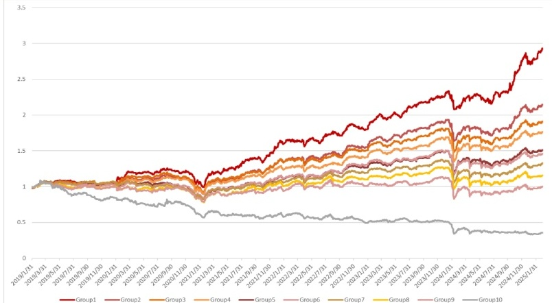

数据来源：wind、ifind、西南证券整理，截至2025年3月31日

从因子分组的相对净值表现来看，相对万得全A，多尺度Transformer因子在2024年1月底出现了较大的超额回撤，但在2024年9月底的上涨行情（0924行情）内并未出现较为明显的超额回撤。

分年度来看，多头组合自2019年至2025年3月，7年均跑赢万得全A指数，其中2021年相对万得全A年化超额35.39%，超额最大回撤12.95%;2023全年相对万得全A年化超额收益率24.86%，超额最大回撤仅3.90%．此外，因子今年以来超额表现较好，2025年初至3月31日，累计超额收益率7.56%，超额最大回撤1.52％。

<!-- 请务必阅读正文后的重要声明部分 9 -->

<!-- 该报告由张子炜于2025年04月30日自Wind金融终端下载，仅供内部使用，请勿传阅 -->

<!-- ziweizhang@suibe.edu.cn -->

<!-- 西南证券 SOUTHWEST SECURITIES -->

<!-- 机器学习应用系列 -->

**表4：多尺度Transformer 因子多头分年度超额表现**

<table border="1" ><tr>
<td>年份</td>
<td>年化收益率</td>
<td>年化波动率</td>
<td>信息比率</td>
<td>最大回撤率</td>
</tr><tr>
<td>2019</td>
<td>4.60%</td>
<td>7.58%</td>
<td>0.61</td>
<td>6.20%</td>
</tr><tr>
<td>2020</td>
<td>9.00%</td>
<td>9.74%</td>
<td>0.92</td>
<td>9.12%</td>
</tr><tr>
<td>2021</td>
<td>35.39%</td>
<td>15.29%</td>
<td>2.31</td>
<td>12.95%</td>
</tr><tr>
<td>2022</td>
<td>16.79%</td>
<td>10.17%</td>
<td>1.65</td>
<td>5.90%</td>
</tr><tr>
<td>2023</td>
<td>24.86%</td>
<td>6.65%</td>
<td>3.74</td>
<td>3.90%</td>
</tr><tr>
<td>2024</td>
<td>22.13%</td>
<td>12.58%</td>
<td>1.76</td>
<td>10.78%</td>
</tr><tr>
<td>202503</td>
<td>7.56%</td>
<td>10.04%</td>
<td>0.75</td>
<td>1.52%</td>
</tr></table>

数据来源：wind、ifind、西南证券整理，截至2025年3月31日

**图10：多尺度Transformer 因子多头分年度净值**

<!-- image_content_description_start -->
本图展示了多尺度Transformer因子多头策略的分年度净值走势，以及超额（右轴）的变化情况，覆盖2019年到2025年期间。
<!-- image_content_description_end -->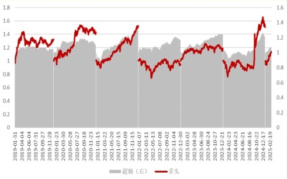

数据来源：wind、ifind、西南证券整理，截至2025年3月31日

# 3 截面模型：基于行业关联图与资金流向图的GAT模型

除了时序数据之外，市场截面结构信息同样对选股模型的表现有着重要影响。在股票市场中，各个股票之间的相互关系和影响是非常复杂的。传统的机器学习方法往往无法充分捕捉这些非线性和动态变化的关联性，而图结构则提供了一种天然的方式来表示这些关系。

个股之间的最显著关系首先为行业分类，我们可以将相同行业的个股之间构建边来表征股票市场中的行业关联关系。由于行业分类较为固定，因此保证了行业关联图结构的长期稳定。此外，个股之间的动态关系同样不应该忽略，而个股之间的资金流向关系可以在某种程度上可以反映个股之间的动态关系。

因此，本文从行业产业关联以及资金流向两个角度出发进行个股间相互影响的分析，分别构建了行业关联图和资金流向图，并用GAT模型对该两类图进行编码处理。在处理行业关联图时，GAT能够稳定地捕捉行业内部的结构信息。此外，在处理资金流向图时，GAT 则能通过动态调整邻居节点的权重，捕捉短期内快速变化的资金流向关系，使模型在具备稳定行业内部关系的同时也可以根据资金流向的变化捕捉个股之间相互影响的关系。

## 3.1行业关联图与资金流向图的构建

本文根据个股量价及财务数据及其对应的申万一级行业分类信息，为行业关联图及资金流向图分别构建7个特征，其中部分特征用来做节点特征，部分特征用来做节点间边的构建，此外，为了进一步丰富节点特征，本文构建了行业关联图与资金流向图共有的节点特征。其中行业关联图和资金流向图的节点特征及边构建特征的定义如下：

<!-- 请务必阅读正文后的重要声明部分 10 -->

<!-- 该报告由张子炜于2025年04月30日自Wind金融终端下载，仅供内部使用，请勿传阅 -->

<!-- ziweizhang@suibe.edu.cn -->

<!-- 西南证券 SOUTHWEST SECURITIES -->

<!-- 机器学习应用系列 -->

**表5：行业关联图及资金流向图构建特征**

<table border="1" ><tr>
<td></td>
<td>特征类别</td>
<td>特征中文名称</td>
<td>特征助记符</td>
<td>特征计算方法</td>
</tr><tr>
<td rowspan="8">共享 特征</td>
<td>节点</td>
<td>收益率动量</td>
<td>retn</td>
<td>过去n 个交易日的累计收益率$(n=20$、60)</td>
</tr><tr>
<td>节点</td>
<td>收益率动量调整</td>
<td>mommn</td>
<td>过去m 日累计收益率-过去n 日累计收益率 $(\mathrm {n}=20,\mathrm {\sim m}=120)$</td>
</tr><tr>
<td>节点</td>
<td>收益率标准差</td>
<td>retstdn</td>
<td>过去n 个交易日的收益率序列标准差$(n=20$、60)</td>
</tr><tr>
<td>节点</td>
<td>换手率波动比</td>
<td>turnstdm</td>
<td>过去n 个交易日换手率标准差／均值 $(n=10$、20)</td>
</tr><tr>
<td>节点</td>
<td>换手率均值</td>
<td>turnnm</td>
<td>过去n 个交易日均换手率取对数 $(n=10、$20、60)</td>
</tr><tr>
<td>节点</td>
<td>正低波因子</td>
<td>posistd</td>
<td>过去n 个交易日正收益率标准差$(n=20$、60)</td>
</tr><tr>
<td>节点</td>
<td>负低波因子</td>
<td>negstd</td>
<td>过去n 个交易日负收益率标准差$(n=20$、60)</td>
</tr><tr>
<td>节点</td>
<td>量价支撑度</td>
<td>$pct_vol_cor$</td>
<td>过去n 日收益率与成交量的相关系数（$(n=20、$、60)</td>
</tr><tr>
<td rowspan="6">资金流网络 特征</td>
<td>节点</td>
<td>近20 日平均成交额</td>
<td>aavg</td>
<td>近20 日平均成交额</td>
</tr><tr>
<td>边</td>
<td>资金流向指标</td>
<td>f</td>
<td>sign （涨跌幅）＊成交额</td>
</tr><tr>
<td>边</td>
<td>换手率变化率</td>
<td>deltatr</td>
<td>该个股当日换手率减去该个股5 日前换手率，再除以其5 日前换手率</td>
</tr><tr>
<td>边</td>
<td>价格-成交量相关系数</td>
<td>corpv</td>
<td>过去20 日序列中该个股收盘价与成交量的相关系数</td>
</tr><tr>
<td>节点</td>
<td>Amihud 非流动性指标</td>
<td>illiq</td>
<td>该个股当日日收益率除以交易金额结果的绝对值的20 日平均取对数</td>
</tr><tr>
<td>节点</td>
<td>成交额波动率</td>
<td>stda</td>
<td>该个股成交额20 日序列的标准差</td>
</tr><tr>
<td rowspan="7">行业 关联</td>
<td>节点</td>
<td>行业PE 中位数</td>
<td>PEind</td>
<td>该个股PE -申万一级行业的所有个股的PE 中位数</td>
</tr><tr>
<td>边</td>
<td>行业收益率相关性</td>
<td>$cor_ret$</td>
<td>个股与对应申万一级行业20 日收益率序列的相关系数</td>
</tr><tr>
<td>边</td>
<td>资产负债率差异度</td>
<td>dlev</td>
<td>ABS （个股资产负债率-一级行业个股资产负债率均值）／一级行业个股资产负债率均值</td>
</tr><tr>
<td>节点</td>
<td>ROE 行业分位数</td>
<td>qroe</td>
<td>申万一级行业中ROE 排名百分位数</td>
</tr><tr>
<td>边</td>
<td>营收增速Z 值</td>
<td>Z</td>
<td>（营收同比增速-行业个股营收同比增速均值）／行业个股营收同比增速标准差</td>
</tr><tr>
<td>节点</td>
<td>PB 行业偏离度</td>
<td>deltapb</td>
<td>（PB ／申万一级行业所有个股PB 的中位数）-1</td>
</tr><tr>
<td>边</td>
<td>经营现金流行业占比</td>
<td>cfr</td>
<td>当季该股经营活动现金流净额／当期该行业所有股票经营活动现金流净额的总和</td>
</tr></table>

数据来源：西南证券整理

### ·行业关联图：

本文选取全部A股作为节点，选取上述行业关联图特征表中的行业PE中位数、ROE 行业分位数、PB行业偏离度作为节点特征；对于相同申万行业分类的股票构建边。同行业构建的边长期稳定，但除了考虑同行业之间的个股的边关系以外，本文根据上述行业关联图特征表中的边权重特征构建除同行业边以外的跨行业关联，旨在捕捉行业间隐性关联（如政策利好跨行业传导或产业链协同效应），避免单一行业划分对复杂市场联动的信息损失，具体构建方式如下：

1）任意截面，提取个股行业关联图边权重特征过去80日的时序序列；

2）分别计算股票A和股票B分别在不同特征上相关系数，并对不同特征相关系数等权求和，得到最终两只股票的相关系数；

3）若股票A和股票B的特征相关系数大于corrthreshold，则股票A和股票B构建边。

<!-- 请务必阅读正文后的重要声明部分 11 -->

<!-- 该报告由张子炜于2025年04月30日自Wind金融终端下载，仅供内部使用，请勿传阅 -->

<!-- ziweizhang@suibe.edu.cn -->

<!-- 西南证券 SOUTHWEST SECURITIES -->

<!-- **机器学习应用系列** -->

### ·资金流向图：

相较于较为稳定的行业关联图，本文构建资金流向图，以捕捉短期切换的个股之间的关系。同样本文选取全部A股作为节点，上述资金流向图中的近20日平均成交额、Amihud 非流动性指标等作为节点特征，选取上述资金流向图中的边权重特征过去80日的时序序列，分别计算各个特征的相关系数并进行等权求和，得到两个不同股票的资金流相关性，若相关性大于相关性阈值（corrthreshold)，则在该两个股票间构建边。

**图11:GAT个股关联信息编码结构**

<!-- image_content_description_start -->
This flowchart illustrates the encoding structure of individual stock association information using GAT, showing the parallel processing of industry association graphs and capital flow graphs, each extracting node and edge features before GAT encoding and feature fusion.
<!-- image_content_description_end -->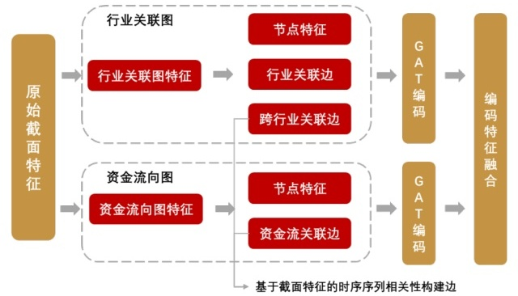

数据来源：西南证券整理

## 3.2基于行业关联图与资金流向图的GAT模型回测结果

在本节中，本文主要测试了依托于个股之间的行业关联信息及资金关联信息构造的图神经网络模型GAT的选股因子效果。自2019年1月至2025年2月，全A范围内GAT模型（indcap-GAT）因子月均IC（以RankIC表征）为8.77%，多头组合年化收益率为32.77%，月均单边换手率0.61X，整体来看，仅靠个股关联信息训练出的indcap-GAT模型具备一定的选股效果，但在因子相关性表现弱于前文提到的多尺度Transformer模型，多头组合表现大致类似，但因子换手有显著的降低。

**表6:Indcap-GAT因子回测结果**

<table border="1" ><tr>
<td></td>
<td>IC</td>
<td>ICIR</td>
<td>Top10 ％组合年化收益率</td>
<td>年化波动</td>
<td>信息比率</td>
<td>最大回撤率</td>
<td>单边月均换手率</td>
</tr><tr>
<td>Indcap-GAT</td>
<td>8.77%</td>
<td>2.95</td>
<td>32.77%</td>
<td>25.97%</td>
<td>1.26</td>
<td>33.12%</td>
<td>0.61</td>
</tr></table>

数据来源：wind、恒生聚源、ifind、西南证券整理，截至2025年3月31日

<!-- 请务必阅读正文后的重要声明部分 12 -->

<!-- 该报告由张子炜于2025年04月30日自Wind金融终端下载，仅供内部使用，请勿传阅 -->

<!-- ziweizhang@suibe.edu.cn -->

<!-- 西南证券 SOUTHWEST SECURITIES -->

<!-- 机器学习应用系列 -->

**图12:Indcap-GAT因子IC**

<!-- image_content_description_start -->
This chart displays the time series of the Indcap-GAT factor IC, showing both the monthly RankIC values (bars) and the cumulative RankIC (right axis, red line) from January 2019 to March 2025.
<!-- image_content_description_end -->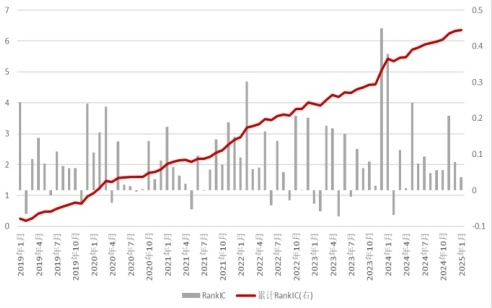

数据来源：wind、ifind、西南证券整理，截至2025年3月31日

**图13:Indcap-GAT因子分组-绝对净值**

<!-- image_content_description_start -->
This chart displays the absolute net value performance over time for ten different Indcap-GAT factor groups, showing the cumulative returns for each group from 2017 to 2025.
<!-- image_content_description_end -->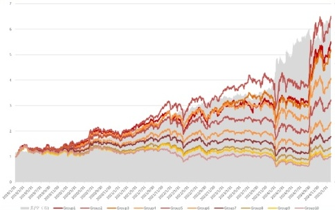

数据来源：wind、ifind、西南证券整理，截至2025年3月31日

从分组角度来看，多头组合（组1）年化收益率32.77%，最大回撤33.12%；空头组合（组10）年化收益率0.02%，最大回撤58.39%；多空组合（组1／组10）年化收益率32.75%，最大回撤14.83%，具备一定单调性。但整体来看，因子多头组合表现并不显著，且组2表现长期来看优于组1，空头组合表现相较Transformer模型并不突出。综合来看，indcapGAT 模型相较于Transformer模型具备更低的换手。

**表7:indcap-GAT因子分组表现**

<table border="1" ><tr>
<td></td>
<td>年化收益率</td>
<td>年化波动率</td>
<td>信息比率</td>
<td>最大回撤率</td>
</tr><tr>
<td>多／空</td>
<td>32.63%</td>
<td>13.80%</td>
<td>2.36</td>
<td>14.83%</td>
</tr><tr>
<td>Group1</td>
<td>32.77%</td>
<td>25.97%</td>
<td>1.26</td>
<td>33.12%</td>
</tr><tr>
<td>Group2</td>
<td>36.31%</td>
<td>24.92%</td>
<td>1.46</td>
<td>32.24%</td>
</tr><tr>
<td>Group3</td>
<td>31.31%</td>
<td>24.79%</td>
<td>1.26</td>
<td>34.14%</td>
</tr><tr>
<td>Group4</td>
<td>26.17%</td>
<td>24.73%</td>
<td>1.06</td>
<td>35.01%</td>
</tr><tr>
<td>Group5</td>
<td>21.42%</td>
<td>24.44%</td>
<td>0.88</td>
<td>35.25%</td>
</tr><tr>
<td>Group6</td>
<td>15.22%</td>
<td>24.57%</td>
<td>0.62</td>
<td>39.60%</td>
</tr><tr>
<td>Group7</td>
<td>10.16%</td>
<td>24.86%</td>
<td>0.41</td>
<td>44.65%</td>
</tr><tr>
<td>Group8</td>
<td>5.18%</td>
<td>25.13%</td>
<td>0.21</td>
<td>47.51%</td>
</tr><tr>
<td>Group9</td>
<td>1.76%</td>
<td>26.21%</td>
<td>0.07</td>
<td>56.41%</td>
</tr><tr>
<td>Group10</td>
<td>0.02%</td>
<td>27.70%</td>
<td>0.00</td>
<td>58.39%</td>
</tr></table>

数据来源：wind、恒生聚源、ifind、西南证券整理，截至2025年3月31日

从因子分组的相对净值表现来看，相对万得全A,indcap-GAT模型因子在2024年1月底出现了较大的超额回撤，但随后回撤快速修复，且在2024年9月底的上涨行情（0924行情）内并未出现较为明显的超额回撤。

<!-- 请务必阅读正文后的重要声明部分 13 -->

<!-- 该报告由张子炜于2025年04月30日自Wind金融终端下载，仅供内部使用，请勿传阅 -->

<!-- ziweizhang@suibe.edu.cn -->

<!-- 西南证券 SOUTHWEST SECURITIES -->

<!-- 机器学习应用系列 -->

图14:indcap-GAT因子分组测试-相对净值

<!-- image_content_description_start -->
This chart shows the relative net value performance of indcap-GAT factor groups compared to 万得全A from January 2019 to March 2025, with ten distinct groups tracked over time.
<!-- image_content_description_end -->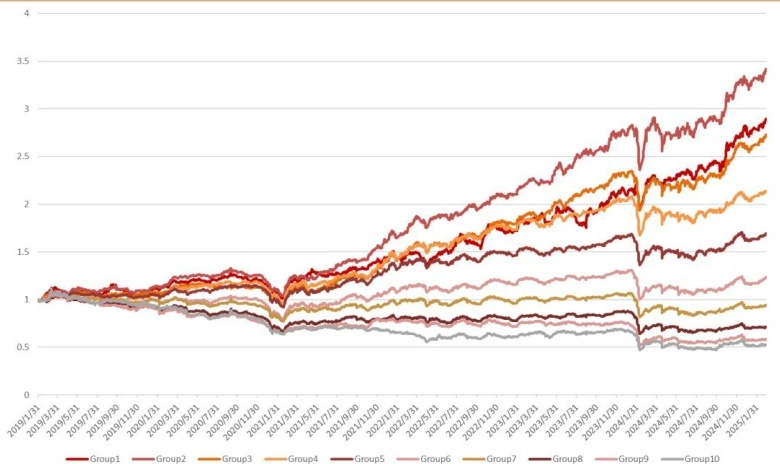

数据来源：wind、ifind、西南证券整理，截至2025年3月31日

分年度来看，多头组合自2019年至2025年3月，7年均跑赢万得全A指数，其中2021年相对万得全A年化超额25.56%，超额最大回撤10.62%;2023全年相对万得全A年化超额收益率23.13%，超额最大回撤10.86％。此外，因子今年以来超额表现较好，2025年初至3月31日，累计超额收益率5.71%，超额最大回撤1.18％。

**表8:indcap-GAT因子多头分年度超额表现**

<table border="1" ><tr>
<td>年份</td>
<td>年化收益率</td>
<td>年化波动率</td>
<td>信息比率</td>
<td>最大回撤率</td>
</tr><tr>
<td>2019</td>
<td>6.97%</td>
<td>11.37%</td>
<td>0.61</td>
<td>9.96%</td>
</tr><tr>
<td>2020</td>
<td>7.42%</td>
<td>8.35%</td>
<td>0.89</td>
<td>11.58%</td>
</tr><tr>
<td>2021</td>
<td>26.56%</td>
<td>12.87%</td>
<td>2.06</td>
<td>10.62%</td>
</tr><tr>
<td>2022</td>
<td>19.06%</td>
<td>13.27%</td>
<td>1.44</td>
<td>10.08%</td>
</tr><tr>
<td>2023</td>
<td>23.13%</td>
<td>12.21%</td>
<td>1.89</td>
<td>10.86%</td>
</tr><tr>
<td>2024</td>
<td>33.94%</td>
<td>15.77%</td>
<td>2.15</td>
<td>11.25%</td>
</tr><tr>
<td>202503</td>
<td>5.71%</td>
<td>9.26%</td>
<td>0.63</td>
<td>1.18%</td>
</tr></table>

数据来源：wind、ifind、西南证券整理，截至2025年3月31日

**图15:indcap-GAT因子多头分年度净值**

<!-- image_content_description_start -->
This chart displays the annual net value performance of the indcap-GAT factor's long positions from January 31, 2019 to December 30, 2024, with comparative shading for "超额（右）" and a highlighted line for "多头".
<!-- image_content_description_end -->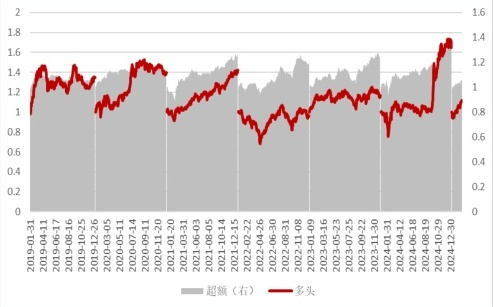

数据来源：wind、ifind、西南证券整理，截至2025年3月31日

<!-- 请务必阅读正文后的重要声明部分 14 -->

<!-- 该报告由张子炜于2025年04月30日自Wind金融终端下载，仅供内部使用，请勿传阅 -->

<!-- ziweizhang@suibe.edu.cn -->

<!-- 西南证券 SOUTHWEST SECURITIES -->

<!-- **机器学习应用系列** -->

# 4 PINN神经网络宏观信息约束

深度学习量化因子挖掘中最终要的问题即是提高模型泛化能力，避免模型过拟合，而模型根据历史数据训练的方式使得模型可以很好的拟合历史个股数据的规律，在实际预测过程中若市场状态发生变化，个股表现的内生驱动逻辑发生变化，则模型很难有较好的表现能力。为了优化此类问题，使得模型在训练的过程中可以接受更多除个股以外的宏观信息，本节将构建可以刻画宏观状态的方程，并引入PINN神经网络，与前述的 Multi-Transformer 以及indcap-GAT模型中结合，构建PINN-Multi Transformer-indcapGAT模型（PINN-MTICG）模型。

## 4.1宏观状态定义及宏观状态方程构建

本节主要基于宏观状态下货币经济学与动态均衡理论，构建一个可以描述货币及信用状态演化的偏微分方程体系。在下述宏观状态方程的构建中，本文构建虚拟变量 $u=u(t)$ 用以隐式的表征宏观状态，并从货币状态和利率调节等多个角度刻画该宏观状态，实现有关变量 $u=u(t)$ 的方程构建。

### ·从货币状态角度刻画宏观状态：

根据费雪方程 $\mathrm {MV}=\mathrm {PT}$ ，等式两边同时取对数可以得到：

$$lnM\;+lnV=lnP+lnT$$

其中M表示货币供应量，V表示货币的流通速度，P表示价格水平，T表示经济交易总量，我们可以将上述四个变量均视作关于时间变化的变量，即：

$M=M$ **(t)**

$V=V$ (t)

$P=P$ (t)

$T=T$ (t)

为了进一步简化方程表达，提升对于深度学习模型的宏观信息约束效率，在费雪方程中，本文假定货币流通速度 $V=V(t)$ 为常数（货币流通速度不变，关于t的导数为0)，因此对上述对数化后的方程进行求导，可以得到：

$$\frac {d(\ln M)}{dt}=\frac {d(\ln P)}{dt}+\frac {d(\ln T)}{dt}$$

可以看出，货币增速可以统一表示价格水平增速与经济交易总量增速，因此本文设定的宏观状态隐变量 $u=u(t)$ 可以视作货币供应增速相关的变量，并存在如下关系：

$$\frac {du}{dt}\propto α\frac {d(\ln M)}{dt}$$

<!-- 请务必阅读正文后的重要声明部分 15 -->

<!-- 该报告由张子炜于2025年04月30日自Wind金融终端下载，仅供内部使用，请勿传阅 -->

<!-- ziweizhang@suibe.edu.cn -->

<!-- 西南证券 SOUTHWEST SECURITIES -->

<!-- **机器学习应用系列** -->

其中α为货币供应增速对宏观状态的边际影响系数， $\text {而}α\frac {d(\mathrm {lnM})}{dt}$ 则在宏观状态的定义中刻画了货币扩张动力。

除此之外，引入均衡货币量M＊为见在经济需求决定的合意货币量，可以通过HP滤波的方式对历史M序列提取得到。为体现货币供应均值回归的情况，进一步刻画货币供应的缺口调节，可以得到：

$$\frac {du}{dt}\propto \beta (lnM-ln\mathrm {M}^{*})$$

### ·从利率调节角度刻画宏观状态：

根据泰勒规则，我们可以得到利率与通胀水平、产出水平的关系如下：

$$r-r^{*}=0.5(\pi -\pi ^{*})+0.5(y-y^{*})$$

其中r表示政策利率， $r^{*}$ 表示自然利率，π表示自然通胀率， $\pi ^{*}$ 表示目标通胀率， $y$ 表示实际产出， $y^{*}$ 表示潜在产出。上述公式将通胀缺口与产出缺口整合为利率调节，因此针在宏观状态方程的构建中，本文引入利率调节项：

$$\frac {du}{dt}\propto -γ\left(\mathrm {r}-\mathrm {r}^{*}\right)$$

在上述方程中，负号表示利率高于自然水平时会抑制经济活力。

·宏观状态方程构建形式：

基于上述货币供应及利率调节情况，本文构建宏观状态方程如下：

$$\frac {du}{dt}=α\frac {d(\ln M)}{dt}+\beta \left(\ln M-\ln M^{*}\right)-γ\left(r-r^{*}\right)$$

在上述方程中，本文以M2货币供应量表征M，以对M2序列进行HP滤波处理得到 $\mathrm {M}^{*}$ ，以10年国债收益率表征r，以10年国债收益率滚动均值表征 $r^{*}$ 。此外，系数 $a$ 、 $y$ 均为方 $\beta$ 以及程可以学习的参数

## 4.2 PINN神经网络及选股模型约束

本节中，本文主要以全连接神经网络的方式构建PINN神经网络。在上节，中本文构建了宏观状态方程，基于货币供应、利率调节的角度刻画了宏观状态隐变量，但由于变量u是隐变量，因此无法获取到真实的u来训练PINN神经网络，而在PINN神经网络中，损失函数主要由两部分构成：数据驱动损失、物理信息损失：

**数据驱动损失项：**

$$L_{data}=\frac {1}{N}\sum _{i=1}^{N}\\ verty_{i}-\widehat {y}_{l}\\ vert^{2}$$

<!-- 请务必阅读正文后的重要声明部分 16 -->

<!-- 该报告由张子炜于2025年04月30日自Wind金融终端下载，仅供内部使用，请勿传阅 -->

<!-- ziweizhang@suibe.edu.cn -->

<!-- 西南证券 SOUTHWEST SECURITIES -->

<!-- **机器学习应用系列** -->

### 物理损失项：

$$L_{\text {physics}}=\frac{1}{M}\sum_{j=1}^{M}\left\|P\left(\widehat{y}_{J},t_{j},x_{j}\right)\right\|^{2}$$

本节的主要目的并非预测未来宏观状态，而是希望将上述宏观状态隐变量纳入到量化因子的挖掘系统中，因此本文将PINN输出的宏观状态隐变量纳入到最终的特征融合层，使其与transformer层输出的特征与GAT输出的特征进行合并，并在最后加入预测头以时间端到端的因子挖掘功能。此外，在上述PINN网络的损失函数中，本文仅考虑物理损失项，即强制PINN输出的隐变量u满足本文所定义的宏观状态方程。因此本文整体选股模型的损失函**数定义如下：**

$$\text {Loss}=1-\mathrm {IC}\left(\mathrm {y},y_{\text {pred}}\right)+λxL_{\text {physics}}$$

其中y表示真实收益， $y_{\text {pred}}$ 表示预测收益， $L_{\text {physics}}$ 表示宏观状态物理损失项。

## 4.3 PINN宏观信息约束的时序截面双流模型测试

本节主要测试基于multi-Transformer与indcap-GAT构建的时序截面双流模型（MTICG）与融合了PINN宏观信息约束的时序截面双流模型（PINN-MTICG）的因子表现效果。

整体来看，自2019年1月至2025年3月，全A范围内月频调仓的前提下，MTICG因子月平均IC为10.99%，多头组合年化收益36.04%，月均单边换手率0.74X。在IC方面表现相较 multi-Transformer 模型并未有明显提升，但多头组合方面表现均优于multi-Transformer 与indcap-GAT模型。此外，PINN-MTICG因子月平均IC为11.41%，多头组合年化收益37.51%，月均单边换手率0.83X，在IC方面相对于MTICG有所提升，多头组合年化收益率相较于MTICG提升1.47%，但换手率相较于其他模型有所上升。

**表9：全A范围内因子测试**

<table border="1" ><tr>
<td></td>
<td>IC</td>
<td>ICIR</td>
<td>Top10 ％组合年化收益率</td>
<td>年化波动</td>
<td>信息比率</td>
<td>最大回撤率</td>
<td>单边月均换手率</td>
</tr><tr>
<td>multi-Transformer</td>
<td>10.95%</td>
<td>3.42</td>
<td>32.88%</td>
<td>23.38%</td>
<td>1.41</td>
<td>27.59%</td>
<td>0.83</td>
</tr><tr>
<td>indcap-GAT</td>
<td>8.77%</td>
<td>2.95</td>
<td>32.77%</td>
<td>25.97%</td>
<td>1.26</td>
<td>33.12%</td>
<td>0.61</td>
</tr><tr>
<td>MTICG</td>
<td>10.99%</td>
<td>3.07</td>
<td>36.04%</td>
<td>24.28%</td>
<td>1.48</td>
<td>25.91%</td>
<td>0.74</td>
</tr><tr>
<td>PINN-MTICG</td>
<td>11.41%</td>
<td>3.14</td>
<td>37.51%</td>
<td>23.81%</td>
<td>1.56</td>
<td>27.29%</td>
<td>0.83</td>
</tr></table>

数据来源：wind、恒生聚源、ifind、西南证券整理，截至2025年3月31日

<!-- 请务必阅读正文后的重要声明部分 17 -->

<!-- 该报告由张子炜于2025年04月30日自Wind金融终端下载，仅供内部使用，请勿传阅 -->

<!-- ziweizhang@suibe.edu.cn -->

<!-- 西南证券 SOUTHWEST SECURITIES -->

<!-- 机器学习应用系列 -->

**图16:MTICG因子IC**

<!-- image_content_description_start -->
This chart displays the monthly performance of the MTICG factor IC, showing both the RankIC values (bars) and the cumulative RankIC (right axis, red line) from January 2019 to March 2025.
<!-- image_content_description_end -->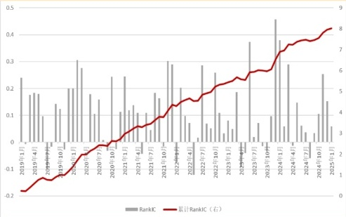

数据来源：wind、ifind、西南证券整理，截至2025年3月31日

**图17:PINN-MTICG因子IC**

<!-- image_content_description_start -->
本图展示了PINN-MTICG因子的IC（信息系数）随时间的变化，包含每月的RankIC柱状图和累计RankIC的折线图，反映因子表现的稳定性和趋势。
<!-- image_content_description_end -->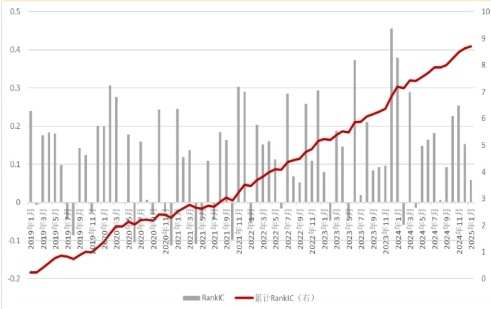

数据来源：wind、ifind、西南证券整理，截至2025年3月31日

分组测试方面，MTICG因子多头组合（组1）年化收益率36.04%，空头组合（组10）年化收益率-0.02%，多空组合（组1／组10）年化收益率39.62%;PINN-MTICG 因子多头组合年化收益率（组1)37.51%，空头组合年化收益率（组10)-4.88%，多空组合（组1／组10）年化收益率44.67％。整体来看，加入宏观信息约束后的PINN-MTICG模型在多头和空头均有贡献，空头提升相对较多。

**图18:MTICG因子分组测试-绝对净值**

<!-- image_content_description_start -->
本图展示了MTICG因子分组（Group1至Group10）在2019年至2025年期间的绝对净值表现，各组净值随时间变化，Group1表现最优，Group10最弱。
<!-- image_content_description_end -->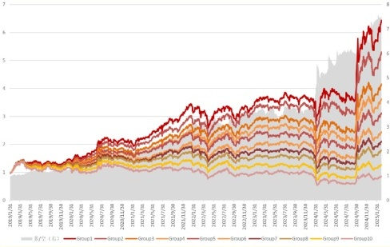

数据来源：wind、ifind、西南证券整理，截至2025年3月31日

**图19:PINN-MTICG因子分组测试-绝对净值**

<!-- image_content_description_start -->
本图展示了PINN-MTICG因子分组在不同分组下的绝对净值随时间的变化趋势，各分组净值均呈现总体增长态势，且分组间存在明显分层。
<!-- image_content_description_end -->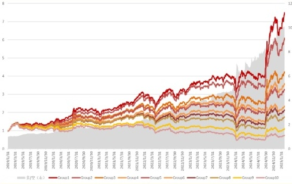

数据来源：wind、ifind、西南证券整理，截至2025年3月31日

从多头组合超额表现来看，PINN-MTICG与-MTICG在2024年1月均出现程度较小的超额回撤，但并未在2024年9月24日后的“0924”行情中出现超额回撤。分年度来看自2019年至2025年3月的7年内，除2020年与2021年以外，PINN-MTICG模型有5年时间超额表现优于MTICG模型。

<!-- 请务必阅读正文后的重要声明部分 -->

<!-- 18 -->

<!-- 该报告由张子炜于2025年04月30日自Wind金融终端下载，仅供内部使用，请勿传阅 -->

<!-- ziweizhang@suibe.edu.cn -->

<!-- 西南证券 SOUTHWEST SECURITIES -->

<!-- 机器学习应用系列 -->

**表10:PINN-MTICG与MTICG模型分年度超额表现**

<table border="1" ><tr>
<td rowspan="2">年份</td>
<td colspan="2">年化收益率</td>
<td colspan="2">年化波动率</td>
<td colspan="2">信息比率</td>
<td colspan="2">最大回撇</td>
<td></td>
</tr><tr>
<td>PINN-MTICG</td>
<td>MTICG</td>
<td>PINN-MTICG</td>
<td>MTICG</td>
<td>PINN-MTICG</td>
<td>MTICG</td>
<td>PINN-MTICG</td>
<td>MTICG</td>
<td></td>
</tr><tr>
<td>2019</td>
<td>10.62%</td>
<td>7.95%</td>
<td>8.25%</td>
<td>7.91%</td>
<td>1.29</td>
<td>1.00</td>
<td>5.79%</td>
<td colspan="2">8.07%</td>
</tr><tr>
<td>2020</td>
<td>15.97%</td>
<td>17.47%</td>
<td>8.80%</td>
<td>8.59%</td>
<td>1.81</td>
<td>2.03</td>
<td>8.15%</td>
<td colspan="2">8.15%</td>
</tr><tr>
<td>2021</td>
<td>24.94%</td>
<td>39.24%</td>
<td>14.39%</td>
<td>14.62%</td>
<td>1.73</td>
<td>2.68</td>
<td>15.54%</td>
<td colspan="2">11.75%</td>
</tr><tr>
<td>2022</td>
<td>27.17%</td>
<td>17.34%</td>
<td>11.10%</td>
<td>11.21%</td>
<td>2.45</td>
<td>1.55</td>
<td>4.84%</td>
<td colspan="2">7.67%</td>
</tr><tr>
<td>2023</td>
<td>32.42%</td>
<td>18.33%</td>
<td>7.41%</td>
<td>6.68%</td>
<td>4.37</td>
<td>2.74</td>
<td>3.60%</td>
<td colspan="2">4.19%</td>
</tr><tr>
<td>2024</td>
<td>40.24%</td>
<td>33.38%</td>
<td>11.74%</td>
<td>12.89%</td>
<td>3.43</td>
<td>2.59</td>
<td>7.35%</td>
<td colspan="2">7.35%</td>
</tr><tr>
<td>202503</td>
<td>6.80%</td>
<td>6.65%</td>
<td>13.66%</td>
<td>11.05%</td>
<td>0.65</td>
<td>0.60</td>
<td>1.45%</td>
<td colspan="2">1.65%</td>
</tr></table>

数据来源：wind、恒生聚源、ifind、西南证券整理，截至2025年3月31日

**图20:MTICG因子分组测试-相对净值**

<!-- image_content_description_start -->
本图展示了MTICG因子分组（Group1至Group10）在不同时间段的相对净值变化趋势。
<!-- image_content_description_end -->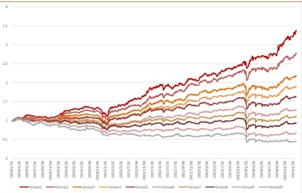

数据来源：wind、ifind、西南证券整理，截至2025年3月31日

**图21:PINN-MTICG因子分组测试-相对净值**

<!-- image_content_description_start -->
This chart presents the relative net value performance of ten groups based on the PINN-MTICG factor grouping test from 2018/1/2 to 2025/3/31.
<!-- image_content_description_end -->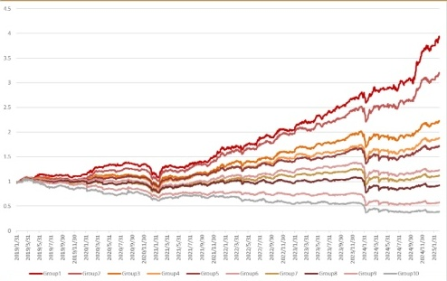

数据来源：wind、ifind、西南证券整理，截至2025年3月31日

**图22:MTICG因子分组测试-相对净值**

<!-- image_content_description_start -->
This chart displays the relative net value performance of MTICG factor groupings over time, showing both the "超额(右)" (excess, right axis) in gray and "多头" (long) in red from January 2019 to March 2025.
<!-- image_content_description_end -->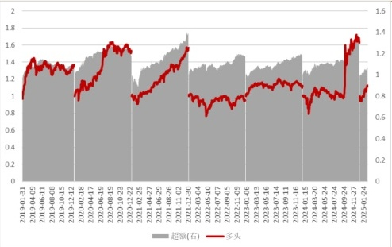

数据来源：wind、ifind、西南证券整理，截至2025年3月31日

**图23:PINN-MTICG因子分组测试-相对净值**

<!-- image_content_description_start -->
本图展示了PINN-MTICG因子分组在不同时间段的相对净值表现，分别以灰色和红色线条表示“超额（右）”与“多头”策略的净值变化趋势。
<!-- image_content_description_end -->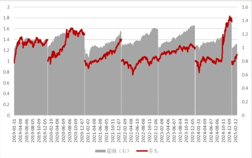

数据来源：wind、ifind、西南证券整理，截至2025年3月31日

<!-- 请务必阅读正文后的重要声明部分 19 -->

<!-- 该报告由张子炜于2025年04月30日自Wind金融终端下载，仅供内部使用，请勿传阅 -->

<!-- ziweizhang@suibe.edu.cn -->

<!-- 西南证券 SOUTHWEST SECURITIES -->

<!-- **机器学习应用系列** -->

# 5模型回测及指数增强策略

## 5.1沪深300指数增强策略

在本节中，本文基于PINN-MTICG分别构建了沪深300指数增强策略。首先在构建指数增强策略之前，本文分别测试了前文中的Multi-Transformer、indcap-GAT,MTICG以及PINN-MTICG模型在沪深300指数成分股内的表现。

**表11**：**沪深300指数成分股因子测试**

<table border="1" ><tr>
<td rowspan="2"></td>
<td rowspan="2">IC</td>
<td rowspan="2">ICIR</td>
<td rowspan="3"></td>
<td>Top10％组合</td>
<td rowspan="2">年化波动</td>
<td rowspan="2">信息比率</td>
<td rowspan="2">最大回撤率</td>
<td>Top10％组合</td>
<td colspan="2">单边月均</td>
</tr><tr>
<td rowspan="2">年化收益率</td>
<td rowspan="2">年化超额收益率</td>
<td rowspan="2">换手率</td>
<td rowspan="2"></td>
</tr><tr>
<td></td>
<td></td>
<td></td>
<td></td>
<td></td>
<td></td>
</tr><tr>
<td>multi-Transformer</td>
<td>5.72%</td>
<td>1.39</td>
<td colspan="2">17.86%</td>
<td>21.68%</td>
<td>0.82</td>
<td>24.60%</td>
<td>11.20%</td>
<td colspan="2">0.84</td>
</tr><tr>
<td>indcap-GAT</td>
<td>10.25%</td>
<td>2.01</td>
<td colspan="2">30.94%</td>
<td>22.38%</td>
<td>1.38</td>
<td>31.09%</td>
<td>23.49%</td>
<td colspan="2">0.63</td>
</tr><tr>
<td>MTICG</td>
<td>9.21%</td>
<td>1.86</td>
<td colspan="2">29.45%</td>
<td>22.36%</td>
<td>1.32</td>
<td>21.64%</td>
<td>22.23%</td>
<td colspan="2">0.77</td>
</tr><tr>
<td>PINN-MTICG</td>
<td>10.24%</td>
<td>2.11</td>
<td colspan="2">31.37%</td>
<td>21.08%</td>
<td>1.49</td>
<td>24.16%</td>
<td>23.78%</td>
<td colspan="2">0.83</td>
</tr></table>

数据来源：wind、恒生聚源、ifind、西南证券整理，截至2025年3月31日

整体来看，量价时序模型并未在沪深300指数成分股中呈现出较好的表现，自2019年1月至2025年3月，Multi-Transformer 模型月均IC仅有5.72%，多头组合年化收益率17.86%，相对沪深300年化超额收益率11.20％。与此同时，基于个股关联信息构建的图模型却在沪深300指数中呈现出较好的选股效果，indcapGAT模型月均IC为10.25%，年化收益率30.94%，年化超额收益率23.49%，月均单边换手率仅0.63X，整体表现优于Multi-Transformer模型。此外，在两个时序截面双流模型中，MTICG与PINN-MTICG在沪深300指数成分股内月均IC分别为9.21％与10.24%，相对沪深300指数年化超额收益率分别为22.23％与23.78%，整体具备一定的选股效果。

指数增强设定如下：个股权重偏离不超过1%,100％成分股内选股，交易费率单边千分之二，回测时间2019年1月至今，月频调仓，调仓当日以wwap价格成交。

**表12：沪深300指数增强策略回测结果**

<table border="1" ><tr>
<td></td>
<td>年化超额收益率</td>
<td>年化波动率</td>
<td>信息比率</td>
<td>最大回撤</td>
</tr><tr>
<td>PINN-MTICG</td>
<td>13.12%</td>
<td>19.33%</td>
<td>0.87</td>
<td>-23.18%</td>
</tr><tr>
<td>MTICG</td>
<td>11.85%</td>
<td>19.54%</td>
<td>0.79</td>
<td>-21.05%</td>
</tr></table>

数据来源：wind、恒生聚源、ifind、西南证券整理，截至2025年3月31日

整体来看，PINN-MTICG模型沪深300指数增强策略年化超额收益率13.12%,MTICG 模型沪深300指数增强策略年化超额收益率11.85％。

<!-- 请务必阅读正文后的重要声明部分 20 -->

<!-- 该报告由张子炜于2025年04月30日自Wind金融终端下载，仅供内部使用，请勿传阅 -->

<!-- ziweizhang@suibbe.edu.cn -->

<!-- 西南证券 SOUTHWEST SECURITIES -->

<!-- 机器学习应用系列 -->

**图24:MTICG沪深300指数增强表现**

<!-- image_content_description_start -->
This chart presents the performance of MTICG-enhanced strategies for the CSI 300 Index over time, comparing the MTICG model, the PINN-MTICG model, and the CSI 300 Index itself from January 2019 to March 2025.
<!-- image_content_description_end -->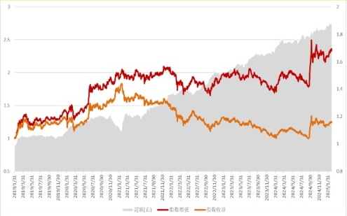

数据来源：wind、ifind、西南证券整理，截至2025年3月31日

**图25:MTICG沪深300指数增强相对净值**

<!-- image_content_description_start -->
本图显示了MTICG沪深300指数增强产品的相对净值随时间的变化趋势，以及超额收益（灰色）在各时间点的表现。
<!-- image_content_description_end -->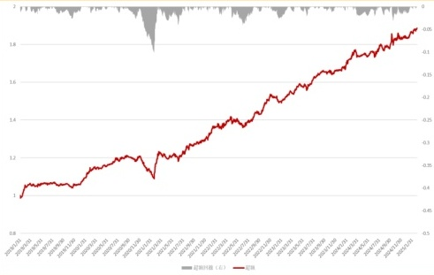

数据来源：wind、ifind、西南证券整理，截至2025年3月31日

**图26:PINN-MTICG沪深300指数增强表现**

<!-- image_content_description_start -->
本图展示了PINN-MTICG沪深300指数增强产品与沪深300指数及其基准净值的表现对比，覆盖2019年至2025年期间的净值变化趋势。
<!-- image_content_description_end -->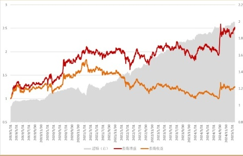

数据来源：wind、ifind、西南证券整理，截至2025年3月31日

**图27:PINN-MTICG沪深300指数增强相对净值**

<!-- image_content_description_start -->
This chart displays the relative net value performance of the PINN-MTICG model for CSI 300 Index enhancement over time, with a main red line showing cumulative growth and a secondary gray area indicating excess return fluctuations.
<!-- image_content_description_end -->

数据来源：wind、ifind、西南证券整理，截至2025年3月31日

分区间来看，截至2025年3月31日，PINN-MTICG模型沪深300指数增强近一个月、三个月、一年、三年超额收益率分别为0.68％、3.22％、9.83％以及13.12%（超过一年计算年化收益率，不足一年计算累计收益率）。

**表13:PINN-MTICG沪深300指数增强策略分区间回测结果**

<table border="1" ><tr>
<td></td>
<td>年化收益率</td>
<td>年化波动率</td>
<td>信息比率</td>
<td>最大回撤</td>
<td>年化超额收益率</td>
</tr><tr>
<td>指数增强（近一年）</td>
<td>20.50%</td>
<td>21.40%</td>
<td>0.96</td>
<td>11.08%</td>
<td>9.83%</td>
</tr><tr>
<td>指数增强（近三年）</td>
<td>10.51%</td>
<td>18.66%</td>
<td>0.56</td>
<td>18.00%</td>
<td>13.12%</td>
</tr><tr>
<td>指数增强（近一月）</td>
<td>1.31%</td>
<td>13.61%</td>
<td>0.10</td>
<td>2.31%</td>
<td>0.68%</td>
</tr><tr>
<td>指数增强（近三月）</td>
<td>1.11%</td>
<td>17.09%</td>
<td>0.07</td>
<td>-6.59%</td>
<td>3.22%</td>
</tr></table>

数据来源：wind、恒生聚源、ifind、西南证券整理，截至2025年3月31日

<!-- 请务必阅读正文后的重要声明部分 -->

<!-- 21 -->

<!-- 该报告由张子炜于2025年04月30日自Wind金融终端下载，仅供内部使用，请勿传阅 -->

<!-- ziweizhang@suibe.edu.cn -->

<!-- 西南证券 SOUTHWEST SECURITIES -->

<!-- 机器学习应用系列 -->

**图28:PINN-MTICG沪深300指数增强表现（近一月）**

<!-- image_content_description_start -->
This chart compares the performance of the PINN-MTICG enhanced CSI 300 Index over the past month, showing three different series with similar upward trends and slight variations.
<!-- image_content_description_end -->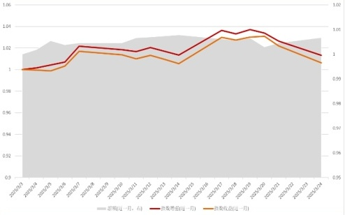

数据来源：wind、ifind、西南证券整理，截至2025年3月31日

**图29:PINN-MTICG沪深300指数增强表现（近三月）**

<!-- image_content_description_start -->
本图展示了PINN-MTICG沪深300指数增强策略在近三个月内的表现，与沪深300指数本身进行对比，并显示超额收益。
<!-- image_content_description_end -->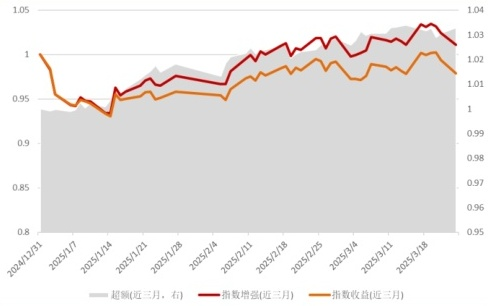

数据来源：wind、ifind、西南证券整理，截至2025年3月31日

**图30:PINN-MTICG沪深300指数增强表现（近一年）**

<!-- image_content_description_start -->
This chart compares the performance of the PINN-MTICG enhanced CSI 300 Index over the past year, showing three series: enhanced (近一年，有), index enhanced (近一年), and index return (近一年).
<!-- image_content_description_end -->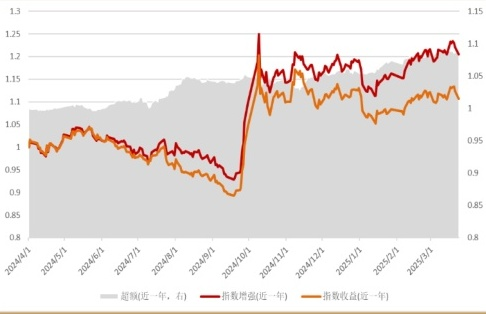

数据来源：wind、ifind、西南证券整理，截至2025年3月31日

**图31:PINN-MTICG沪深300指数增强表现（近三年）**

<!-- image_content_description_start -->
本图展示了PINN-MTICG模型在沪深300指数增强策略下近三年的超额收益与累计收益表现。
<!-- image_content_description_end -->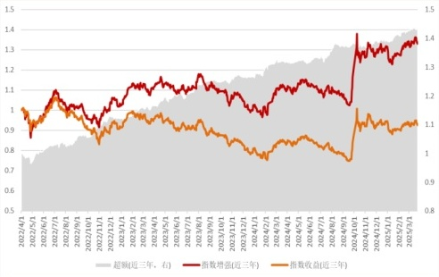

数据来源：wind、ifind、西南证券整理，截至2025年3月31日

## 5.2中证1000指数增强策略

在本节中，本文基于PINN-MTICG构建了中证1000指数增强策略。首先在构建指数增强策略之前，本文分别测试了前文中的 Multi-Transformer、indcap-GAT,MTICG 以及PINN-MTICG模型在中证1000指数成分股内的表现。

**表14：中证1000指数成分股因子测试**

<table border="1" ><tr>
<td rowspan="2"></td>
<td rowspan="2">IC</td>
<td rowspan="2">ICIR</td>
<td rowspan="3">Top10％组合年化收益率</td>
<td rowspan="2">年化波动</td>
<td rowspan="2">信息比率</td>
<td rowspan="3">最大回撤率</td>
<td>Top10%</td>
<td></td>
<td>单边月均</td>
<td></td>
</tr><tr>
<td rowspan="2">年化超额收益率</td>
<td colspan="2" rowspan="2">换手率</td>
<td rowspan="2"></td>
</tr><tr>
<td></td>
<td></td>
<td></td>
<td></td>
<td></td>
</tr><tr>
<td>multi-Transformer</td>
<td>10.59%</td>
<td>3.42</td>
<td>28.05%</td>
<td>24.17%</td>
<td>1.16</td>
<td>32.47%</td>
<td>14.26%</td>
<td colspan="3">0.83</td>
</tr><tr>
<td>indcap-GAT</td>
<td>9.07%</td>
<td>2.67</td>
<td>31.32%</td>
<td>27.17%</td>
<td>1.15</td>
<td>32.75%</td>
<td>18.08%</td>
<td colspan="3">0.61</td>
</tr><tr>
<td>MTICG</td>
<td>10.71%</td>
<td>2.76</td>
<td>35.49%</td>
<td>25.40%</td>
<td>1.40</td>
<td>28.28%</td>
<td>21.25%</td>
<td colspan="3">0.74</td>
</tr><tr>
<td>PINN-MTICG</td>
<td>11.62%</td>
<td>3.03</td>
<td>37.21%</td>
<td>25.03%</td>
<td>1.49</td>
<td>28.95%</td>
<td>22.77%</td>
<td colspan="3">0.83</td>
</tr></table>

数据来源：wind、恒生聚源、ifind、西南证券整理，截至2025年3月31日

<!-- 请务必阅读正文后的重要声明部分 22 -->

<!-- 该报告由张子炜于2025年04月30日自Wind金融终端下载，仅供内部使用，请勿传阅 -->

<!-- ziweizhang@suibe.edu.cn -->

<!-- 西南证券 SOUTHWEST SECURITIES -->

<!-- **机器学习应用系列** -->

整体来看，量价时序模型并未在中证1000指数成分股中表现较好，自2019年1月至2025年3月，Multi-Transformer模型月均IC为10.59%，多头组合年化收益率28.05%，相对中证1000指数年化超额收益率14.26％。与此同时，基于个股关联信息构建的图模型却在中证1000指数中选股效果同样不俗，indcapGAT模型月均IC为9.07%，年化收益率31.32%，年化超额收益率18.08%，月均单边换手0.61X。此外，在两个时序截面双流模型中，MTICG与PINN-MTICG在中证1000指数成分股内月均IC分别为10.71％与11.62%，相对中证1000指数年化超额收益率分别为21.25％与22.77%，整体具备一定的选股效果。

指数增强设定如下：个股权重偏离不超过1%,100％成分股内选股，交易费率单边千分之二，回测时间2019年1月至今，月频调仓，调仓当日以wwap价格成交。

**表15：中证1000指数增强策略回测结果**

<table border="1" ><tr>
<td></td>
<td>年化超额收益率</td>
<td>年化波动率</td>
<td>信息比率</td>
<td>最大回撤</td>
</tr><tr>
<td>PINN-MTICG</td>
<td>17.07%</td>
<td>25.17%</td>
<td>0.93</td>
<td>-31.74%</td>
</tr><tr>
<td>MTICG</td>
<td>15.23%</td>
<td>25.52%</td>
<td>0.86</td>
<td>-34.11%</td>
</tr></table>

数据来源：wind、恒生聚源、ifind、西南证券整理，截至2025年3月31日

整体来看，PINN-MTICG模型中证1000指数增强策略年化超额收益率17.07%, MTICG 模型沪深300指数增强策略年化超额收益率15.23％。

**图32:MTICG中证1000指数增强表现**

<!-- image_content_description_start -->
本图展示了MTICG模型中证1000指数增强策略、指数基准和指数增强的相对净值在2019年至2025年期间的走势，突出增强策略的超额收益表现。
<!-- image_content_description_end -->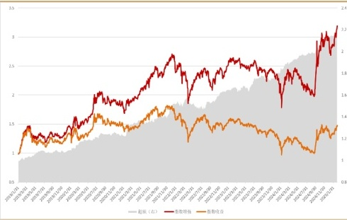

数据来源：wind、ifind、西南证券整理，截至2025年3月31日

**图33:MTICG中证1000指数增强相对净值**

<!-- image_content_description_start -->
This chart displays the relative net value performance of the MTICG CSI 1000 Index Enhanced product over time, with a secondary indicator of excess returns shown above the main time series.
<!-- image_content_description_end -->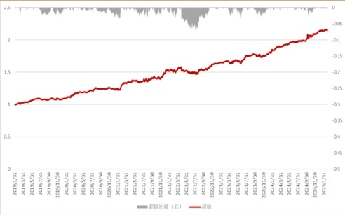

数据来源：wind、ifind、西南证券整理，截至2025年3月31日

**图34:PINN-MTICG中证1000指数增强表现**

<!-- image_content_description_start -->
本图展示了PINN-MTICG中证1000指数增强、指数净值和基准净值在2021年1月到2025年3月期间的走势对比。
<!-- image_content_description_end -->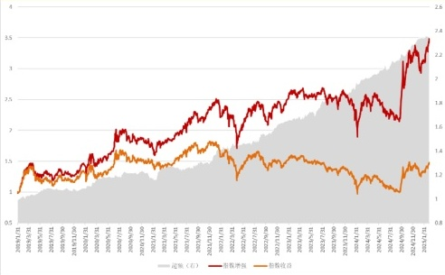

数据来源：wind、ifind、西南证券整理，截至2025年3月31日

**图35:PINN-MTICG中证1000指数增强相对净值**

<!-- image_content_description_start -->
该图展示了PINN-MTICG模型下中证1000指数增强策略的相对净值随时间的变化趋势，以及超额收益的波动情况。
<!-- image_content_description_end -->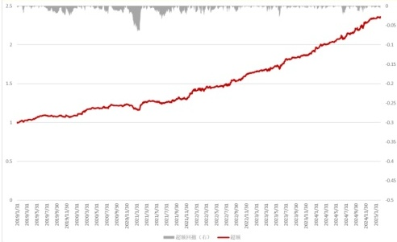

数据来源：wind、ifind、西南证券整理，截至2025年3月31日

<!-- 请务必阅读正文后的重要声明部分 23 -->

<!-- 该报告由张子炜于2025年04月30日自Wind金融终端下载，仅供内部使用，请勿传阅 -->

<!-- ziweizhang@suibe.edu.cn -->

<!-- 西南证券 SOUTHWEST SECURITIES -->

<!-- **机器学习应用系列** -->

分区间来看，截至2025年3月31日，PINN-MTICG模型中证1000指数增强近一个月、三个月、一年、三年超额收益率分别为1.71％、3.02％、23.81％以及18.68%（超过一年计算年化收益率，不足一年计算累计收益率）。

**表16:PINN-MTICG中证1000指数增强策略分区间回测结果**

<table border="1" ><tr>
<td></td>
<td>年化收益率</td>
<td>年化波动率</td>
<td>信息比率</td>
<td>最大回撤</td>
<td>年化超额收益率</td>
</tr><tr>
<td>指数增强（近一年）</td>
<td>41.53%</td>
<td>31.18%</td>
<td>1.33</td>
<td>-17.53%</td>
<td>23.81%</td>
</tr><tr>
<td>指数增强（近三年）</td>
<td>16.75%</td>
<td>26.57%</td>
<td>0.63</td>
<td>-29.39%</td>
<td>18.68%</td>
</tr><tr>
<td>指数增强（近一月）</td>
<td>3.87%</td>
<td>16.19%</td>
<td>0.24</td>
<td>-2.60%</td>
<td>1.71%</td>
</tr><tr>
<td>指数增强（近三月）</td>
<td>7.24%</td>
<td>24.77%</td>
<td>0.29</td>
<td>-9.88%</td>
<td>3.02%</td>
</tr></table>

数据来源：wind、恒生聚源、ifind、西南证券整理，截至2025年3月31日

**图36:PINN-MTICG中证1000指数增强表现（近一月）**

<!-- image_content_description_start -->
This chart displays the performance of the PINN-MTICG CSI 1000 Index Enhanced over the past month, comparing three metrics: 超额(近一月，右), 指数增强(近一月), and 指数收益(近一月) from March 3, 2025 to March 24, 2025.
<!-- image_content_description_end -->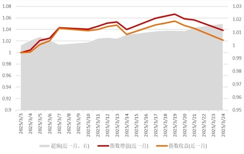

数据来源：wind、ifind、西南证券整理，截至2025年3月31日

**图37:PINN-MTICG中证1000指数增强表现（近三月）**

<!-- image_content_description_start -->
本图展示了PINN-MTICG中证1000指数增强产品在近三个月内的表现，比较了超额收益、指数增强和指数收益的走势。
<!-- image_content_description_end -->

数据来源：wind、ifind、西南证券整理，截至2025年3月31日

**图38:PINN-MTICG中证1000指数增强表现（近一年）**

<!-- image_content_description_start -->
本图展示了PINN-MTICG中证1000指数增强在近一年内的超额、指数增强和指数收益的表现趋势。
<!-- image_content_description_end -->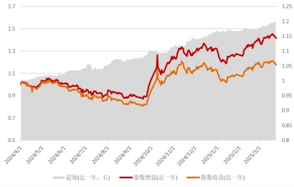

数据来源：wind、ifind、西南证券整理，截至2025年3月31日

**图39:PINN-MTICG中证1000指数增强表现（近三年）**

<!-- image_content_description_start -->
本图展示了PINN-MTICG模型在中证1000指数增强策略下近三年的超额收益和指数增强收益的表现，对比了模型与基准的收益曲线。
<!-- image_content_description_end -->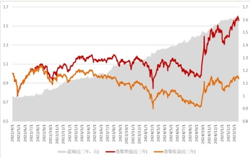

数据来源：wind、ifind、西南证券整理，截至2025年3月31日

<!-- 请务必阅读正文后的重要声明部分 24 -->

<!-- 该报告由张子炜于2025年04月30日自Wind金融终端下载，仅供内部使用，请勿传阅 -->

<!-- ziweizhang@suibe.edu.cn -->

<!-- 西南证券 SOUTHWEST SECURITIES -->

<!-- **机器学习应用系列** -->

# 6 总结与展望

本文构建了一类融合时序特征、截面关联及宏观信息约束的深度学习选股框架--PINN 信息约束与时序截面双流网络模型（PINN-MTICG）。通过多尺度Transformmer模型捕捉个股量价数据的长期时序依赖，结合图注意力网络（GAT）挖掘行业关联与资金流向的非线性关系，并引入物理信息神经网络（PINN）嵌入宏观经济方程作为软约束。模型实现了“微观特征-中观关联-宏观状态”的多层次信息融合。回测结果显示，全A范围内，在2019年1月至2025年2月，PINN-MTICG模型月均IC达11.41%，年化收益率37.51%，整体表现优于单一时序或截面模型。在指数增强策略中，该模型对沪深300和中证1000的年化超额收益率分别达到13.12％和17.07%，展现出一定的选股能力和策略稳定性。

尽管模型在多维度特征融合和宏观约束方面取得了一定突破，但仍存在改进空间。本文虽然引入PINN提升了模型的宏观适应性，但宏观经济方程的设定仍依赖简化假设（如货币流通速度恒定），可能忽略部分复杂经济变量的非线性影响。此外，模型的换手率在融合后有所上升，尤其在市场风格快速切换时可能增加交易成本。最后，当前模型对历史数据的依赖性较高，未来需进一步验证其在不同经济周期和极端市场环境下的鲁棒性，以避免过拟合风险。

展望未来，研究可从以下几个方向深化：其一，丰富宏观约束维度，纳入更多实时经济指标（如PMI、消费者信心指数）或政策变量，也可以结合NLP技术解析央行报告等非结构化数据，增强宏观状态方程的完备性。其二，本文中模型输出预测部分简单的将时序Transformer编码与GAT编码后的信息进行合并预测，并未考虑到时序信息与个股关联信息之间的相对强弱，可以适当引入自适应门控网络或注意力机制，提升模型对市场状态变化的响应速度。其三，改进图的构建方法，例如引入动态图网络（DGNN）实时捕捉资金流向和行业关联的变化，或结合知识图谱技术整合产业链上下游关系，提升截面关联的刻画精度。其四，加入宏观约束的时序截面双流网络模型因子换手率有所提升，未来可以在因子构建过程中进行强化学习结合的探索，通过智能调仓机制平衡收益与风险，降低换手率并提升策略的实操性。

# 7 风险提示

报告对应的相关结论完全基于公开的历史数据进行算法构建、统计以及计算，文中部分数据有一定滞后性，同时也存在第三方数据提供不准确或者缺失等风险；策略效果结论仅针对于回测区间得出，并不预示其未来表现，也不能保证未来的可持续性，亦不构成投资收益的保证或投资建议。

<!-- 请务必阅读正文后的重要声明部分 25 -->

<!-- 该报告由张子炜于2025年04月30日自Wind金融终端下载，仅供内部使用，请勿传阅 -->

<!-- ziweizhang@suibe.edu.cn -->

<!-- 西南证券 -->

<!--  -->

<!-- SOUTHWEST SECURITIES 机器学习应用系列 -->

## 分析师承诺

本报告署名分析师具有中国证券业协会授予的证券投资咨询执业资格并注册为证券分析师，报告所采用的数据均来自合法合规渠道，分析逻辑基于分析师的职业理解，通过合理判断得出结论，独立、客观地出具本报告。分析师承诺不曾因，不因，也将不会因本报告中的具体推荐意见或观点而直接或间接获取任何形式的补偿。

## 投资评级说明

报告中投资建议所涉及的评级分为公司评级和行业评级（另有说明的除外）。评级标准为报告发布日后6个月内的相对市场表现，即：以报告发布日后6个月内公司股价（或行业指数）相对同期相关证券市场代表性指数的涨跌幅作为基准。其中：A股市场以沪深300指数为基准，新三板市场以三板成指（针对协议转让标的）或三板做市指数（针对做市转让标的）为基准；香港市场以恒生指数为基准；美国市场以纳斯达克综合指数或标普500指数为基准。

<table border="1" ><tr>
<td rowspan="5">公司评级</td>
<td>买入：未来6 个月内，个股相对同期相关证券市场代表性指数涨幅在20 ％以上</td>
</tr><tr>
<td>持有：未来6 个月内，个股相对同期相关证券市场代表性指数涨幅介于10 ％与20 ％之间</td>
</tr><tr>
<td>中性：未来6 个月内，个股相对同期相关证券市场代表性指数涨幅介于-10 ％与10 ％之间</td>
</tr><tr>
<td>回避：未来6 个月内，个股相对同期相关证券市场代表性指数涨幅介于-20 ％与-10 ％之间</td>
</tr><tr>
<td>卖出：未来6 个月内，个股相对同期相关证券市场代表性指数涨幅在-20 ％以下</td>
</tr><tr>
<td rowspan="3">行业评级</td>
<td>强于大市：未来6 个月内，行业整体回报高于同期相关证券市场代表性指数5 ％以上</td>
</tr><tr>
<td>跟随大市：未来6 个月内，行业整体回报介于同期相关证券市场代表性指数-5 ％与5 ％之间</td>
</tr><tr>
<td>弱于大市：未来6 个月内，行业整体回报低于同期相关证券市场代表性指数-5 ％以下</td>
</tr></table>

## 重要声明

西南证券股份有限公司（以下简称“本公司”）具有中国证券监督管理委员会核准的证券投资咨询业务资格。

本公司与作者在自身所知情范围内，与本报告中所评价或推荐的证券不存在法律法规要求披露或采取限制、静默措施的利益冲突。

《证券期货投资者适当性管理办法》于2017年7月1日起正式实施，本报告仅供本公司签约客户使用，若您并非本公司签约客户，为控制投资风险，请取消接收、订阅或使用本报告中的任何信息。本公司也不会因接收人收到、阅读或关注自媒体推送本报告中的内容而视其为客户。本公司或关联机构可能会持有报告中提到的公司所发行的证券并进行交易，还可能为这些公司提供或争取提供投资银行或财务顾问服务。

本报告中的信息均来源于公开资料，本公司对这些信息的准确性、完整性或可靠性不作任何保证。本报告所载的资料、意见及推测仅反映本公司于发布本报告当日的判断，本报告所指的证券或投资标的的价格、价值及投资收入可升可跌，过往表现不应作为日后的表现依据。在不同时期，本公司可发出与本报告所载资料、意见及推测不一致的报告，本公司不保证本报告所含信息保持在最新状态。同时，本公司对本报告所含信息可在不发出通知的情形下做出修改，投资者应当自行关注相应的更新或修改。

本报告仅供参考之用，不构成出售或购买证券或其他投资标的要约或邀请。在任何情况下，本报告中的信息和意见均不构成对任何个人的投资建议。投资者应结合自己的投资目标和财务状况自行判断是否采用本报告所载内容和信息并自行承担风险，本公司及雇员对投资者使用本报告及其内容而造成的一切后果不承担任何法律责任。

本报告及附录版权为西南证券所有，未经书面许可，任何机构和个人不得以任何形式翻版、复制和发布。如引用须注明出处为“西南证券”，且不得对本报告及附录进行有悖原意的引用、删节和修改。未经授权刊载或者转发本报告及附录的，本公司将保留向其追究法律责任的权利。

<!-- 请务必阅读正文后的重要声明部分 -->

<!-- 该报告由张子炜于2025年04月30日自Wind金融终端下载，仅供内部使用，请勿传阅 -->

<!-- ziweizhang@suibe.edu.cn -->

<!-- 西南证券 -->

<!--  -->

<!-- SOUTHWEST SECURITIES 机器学习应用系列 -->

# 西南证券研究院

**上海**

地址：上海市浦东新区陆家嘴21世纪大厦10楼

邮编：200120

**北京**

地址：北京市西城区金融大街35号国际企业大厦A座8楼

邮编：100033

**深圳**

地址：深圳市福田区益田路6001号太平金融大厦22楼

邮编：518038

**重庆**

地址：重庆市江北区金沙门路32号西南证券总部大楼21楼

邮编：400025

# 西南证券机构销售团队

<table border="1" ><tr>
<td>区域</td>
<td>姓名</td>
<td>职务</td>
<td>座机</td>
<td>手机</td>
<td>邮箱</td>
</tr><tr>
<td rowspan="10">上海</td>
<td>蒋诗烽</td>
<td>总经理助理、销售总监</td>
<td>021-68415309</td>
<td>18621310081</td>
<td>jsf@swsc.com.cn</td>
</tr><tr>
<td>崔露文</td>
<td>销售副总监</td>
<td>15642960315</td>
<td>15642960315</td>
<td>clw@swsc.com.cn</td>
</tr><tr>
<td>李煜</td>
<td>资深销售经理</td>
<td>18801732511</td>
<td>18801732511</td>
<td>yfliyu@swsc.com.cn</td>
</tr><tr>
<td>田婧雯</td>
<td>高级销售经理</td>
<td>18817337408</td>
<td>18817337408</td>
<td>tjw@swsc.com.cn</td>
</tr><tr>
<td>汪艺</td>
<td>高级销售经理</td>
<td>13127920536</td>
<td>13127920536</td>
<td>wyyf@swsc.com.cn</td>
</tr><tr>
<td>张玉梅</td>
<td>销售经理</td>
<td>18957157330</td>
<td>18957157330</td>
<td>zymyf@swsc.com.cn</td>
</tr><tr>
<td>欧若诗</td>
<td>销售经理</td>
<td>18223769969</td>
<td>18223769969</td>
<td>ors@swsc.com.cn</td>
</tr><tr>
<td>李嘉隆</td>
<td>销售经理</td>
<td>15800507223</td>
<td>15800507223</td>
<td>ljlong@swsc.com.cn</td>
</tr><tr>
<td>龚怡芸</td>
<td>销售经理</td>
<td>13524211935</td>
<td>13524211935</td>
<td>gongyy@swsc.com.cn</td>
</tr><tr>
<td>蒋宇洁</td>
<td>销售经理</td>
<td>15905851569</td>
<td>15905851569</td>
<td>jyj@swsc.com.c</td>
</tr><tr>
<td rowspan="8">北京</td>
<td>李杨</td>
<td>销售总监</td>
<td>18601139362</td>
<td>18601139362</td>
<td>yfly@swsc.com.cn</td>
</tr><tr>
<td>张岚</td>
<td>销售副总监</td>
<td>18601241803</td>
<td>18601241803</td>
<td>zhanglan@swsc.com.cn</td>
</tr><tr>
<td>杨薇</td>
<td>资深销售经理</td>
<td>15652285702</td>
<td>15652285702</td>
<td>yangwei@swsc.com.cn</td>
</tr><tr>
<td>姚航</td>
<td>资深销售经理</td>
<td>15652026677</td>
<td>15652026677</td>
<td>yhang@swsc.com.cn</td>
</tr><tr>
<td>张鑫</td>
<td>高级销售经理</td>
<td>15981953220</td>
<td>15981953220</td>
<td>zhxin@swsc.com.cn</td>
</tr><tr>
<td>王一菲</td>
<td>高级销售经理</td>
<td>18040060359</td>
<td>18040060359</td>
<td>wyf@swsc.com.cn</td>
</tr><tr>
<td>王宇飞</td>
<td>高级销售经理</td>
<td>18500981866</td>
<td>18500981866</td>
<td>wangyuf@swsc.com</td>
</tr><tr>
<td>马冰竹</td>
<td>销售经理</td>
<td>13126590325</td>
<td>13126590325</td>
<td>mbz@swsc.com.cn</td>
</tr><tr>
<td rowspan="5">广深</td>
<td>郑龑</td>
<td>广深销售负责人</td>
<td>18825189744</td>
<td>18825189744</td>
<td>zhengyan@swsc.com.cn</td>
</tr><tr>
<td>龚之涵</td>
<td>高级销售经理</td>
<td>15808001926</td>
<td>15808001926</td>
<td>gongzh@swsc.com.cn</td>
</tr><tr>
<td>杨举</td>
<td>销售经理</td>
<td>13668255142</td>
<td>13668255142</td>
<td>yangju@swsc.com.cn</td>
</tr><tr>
<td>陈韵然</td>
<td>销售经理</td>
<td>18208801355</td>
<td>18208801355</td>
<td>cyryf@swsc.com.cn</td>
</tr><tr>
<td>林哲睿</td>
<td>销售经理</td>
<td>15602268757</td>
<td>15602268757</td>
<td>lzr@swsc.com.cn</td>
</tr></table>

<!-- 请务必阅读正文后的重要声明部分 -->

<!-- 该报告由张子炜于2025年04月30日自Wind金融终端下载，仅供内部使用，请勿传阅 -->

<!-- ziweizhang@suibe.edu.cn -->

<!-- 西南证券 -->

<!--  -->

<!-- SOUTHWEST SECURITIES 机器学习应用系列 -->

<!-- 请务必阅读正文后的重要声明部分 -->

