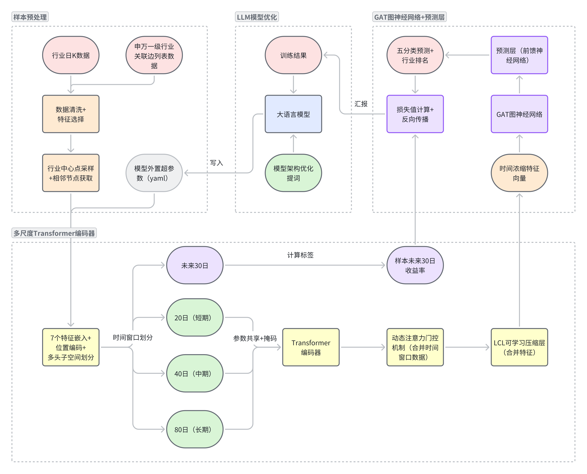

## 摘要

## 1 引言

### 1.1 研究背景与动机

根据《中共中央关于制定国民经济和社会发展第十五个五年规划的建议》，围绕新产业明确了 “4+6” 的战略布局，规划明确将新能源、新材料、航空航天、低空经济等列为重点打造的新兴支柱产业，政策导向下产业间协同发展态势愈发显著，股市中行业联动效应与协同收益特征日益凸显。股票市场作为宏观经济与产业政策的晴雨表，行业收益率不仅受自身经营状况影响，还深度依赖产业链上下游的传导作用、政策红利的辐射效应以及跨行业的资源联动，准确捕捉这些复杂关联成为提升收益率预测精度的关键。在此背景下，挖掘行业间的协同关系与时序演化规律，对投资者优化决策、市场提升资源配置效率具有重要的现实意义。

传统行业收益率预测方法多聚焦单一行业的历史数据，难以刻画跨行业的动态关联与多尺度时序特征，导致预测结果难以适应复杂多变的市场环境。随着深度学习技术在金融领域的深度应用，时序模型与图神经网络的融合为解决这一问题提供了新路径。Transformer 模型凭借自注意力机制，能够有效捕获时间序列中不同周期的依赖关系，尤其在多尺度数据处理中展现出突出优势，为提取行业收益率的短期波动与长期趋势特征提供了技术支撑；图注意力网络（GAT）则通过对节点重要性的动态加权，可精准挖掘行业间的隐性关联与协同收益规律，弥补传统模型对行业网络结构信息利用不足的缺陷。

基于此，本文立足 “十五五” 规划下产业协同发展的政策背景，以 2021-2025 年股市多层面数据为研究对象，构建融合多尺度 Transformer 与图注意力网络的行业收益率预测模型。模型通过多尺度 Transformer 提取不同时间频率下的收益率时序特征，利用 GAT 挖掘行业间的历史关联与协同效应，实现对行业收益率的精准预测。本文的研究旨在为行业收益率预测提供新的技术范式，同时为投资者把握政策导向下的产业协同投资机会提供决策参考。

### 1.2 研究目标与贡献

本研究旨在提出一个基于多尺度Transformer与图注意力网络（GAT）相融合的行业收益率预测模型，以克服传统时序模型在捕捉金融数据复杂动态和行业间关联性方面的不足。具体目标包括：

1. 构建多尺度时序特征提取模块： 采用多尺度Transformer结构，从 2021 年至 2025 年的行业收益率序列中，有效提取不同时间尺度上的高频与低频时间特征信息。
	
2. 集成行业拓扑结构信息： 利用图注意力网络（GAT），将申万一级行业分类下的各行业视为图的节点，并通过计算它们在历史交易中的相互影响，动态捕捉和量化行业间的历史关联性。
	
3. 实现跨层面信息融合： 设计有效的信息融合机制，将Transformer提取的时间特征与GAT提取的行业关联特征进行整合，以构建一个全面反映股市多层面动态的预测模型。
	
4. 提升预测准确性与稳定性： 针对 2021 年至 2025 年中国股市的实证研究，验证所提出模型在行业收益率预测任务上的准确性和有效性，为量化投资策略提供支持。

### 1.3 研究创新点


## 2 文献综述

### 2.1 金融市场有效性研究

市场有效性是金融市场资源配置效率和预测有效性的核心衡量标准，其核心逻辑在于市场价格能否及时、充分反映所有可用信息，这决定了使用历史数据进行预测是否有效。A 股市场作为新兴加转轨的资本市场，受制度环境、投资者结构、市场机制等多重因素影响，其有效性呈现出独特特征。有效市场假说由 Fama（1970）提出，将市场有效性划分为弱式有效、半强式有效与强式有效三个层次：弱式有效市场中，价格已反映所有历史交易信息，技术分析无效；半强式有效市场中，价格能迅速吸收所有公开信息，基本面分析与事件驱动策略难以获取超额收益；强式有效市场中，价格涵盖所有公开与内幕信息，任何投资者均无法获得超额收益。关于A股市场是否有效，许多学者做了相关的研究。

王捷（2019）以 2007-2017 年 A 股高送转股票为样本，通过事件研究法分析预案公布日前后 70 天的收益表现，发现存在显著的超额收益。这一现象表明，投资者可通过追逐高送转概念获取超额收益，违背了半强式有效市场的核心逻辑，反映出 A 股市场对这类公开事件的信息消化存在滞后性。禹霆（2019）以深圳市场 2017 年年报披露的 50 家上市公司为样本，采用 CAPM 模型计算超额收益，发现年报公布后仍存在可捕捉的超额收益，证实深市尚未达到半强式有效。这一结论与多数年报、季报披露相关研究一致，反映出 A 股市场在公开财务信息的价格传导机制上仍存在效率缺口。

Laura Gardini（2025）的研究为上述现象提供了理论解释，其构建的技术分析与基本面分析互动模型表明，两类分析方式的博弈会影响价格发现效率。在 A 股市场，个人投资者对技术面与事件概念的过度关注，进一步放大了信息反应的滞后性，加剧了市场的非有效性。

综上所述，现有研究已形成三点明确共识：一是 A 股市场尚未达到半强式有效，历史交易信息与公开信息均能为投资者提供超额收益机会；二是经典资产定价模型在 A 股市场存在适配性缺陷，壳资源等特殊因素导致定价机制扭曲，需结合制度背景进行模型修正；三是制度变革、投资者结构优化与市场机制完善是提升 A 股市场有效性的关键路径。
### 2.1 传统时间序列预测方法

时间序列预测是金融、气象、工业等多个领域的核心技术之一，其核心目标是通过挖掘数据的时序依赖关系，实现对未来趋势的精准推断。随着数据规模扩大与复杂性提升，传统时间序列预测方法不断迭代，从统计模型逐步向深度学习模型演进。

传统统计方法以数据的线性假设与平稳性假设为基础，通过数学建模刻画时序数据的基本规律，在早期时间序列预测中占据主导地位。随着深度学习技术的发展，基于神经网络的方法突破了传统统计模型的线性约束，通过多层网络结构自动提取时序数据的深层特征，显著提升了预测性能。但是早期深度学习方法虽突破了线性约束，但仍存在明显缺陷。

Vaswani（2017）在《Attention is All you Need》中提出 Transformer 模型成为了转折点，该模型摒弃传统循环结构，基于自注意力机制实现全序列并行计算，为时间序列预测带来革命性突破。此后，学界与业界围绕 Transformer 的局限性展开一系列改进，形成了适配时序预测场景的多样化模型。在股票收益率预测等金融场景中，基础 Transformer 模型通过量价时序特征训练，展现出优于 LSTM 的预测性能。

例如，郑琳琳（2025）针对传统位置编码的缺陷，提出双通道门控动态位置编码（Double-Gate DPE），融合时间周期编码（周度、月度、季度）与市场状态编码（波动率、行业轮动速度、流动性），通过门控网络动态调整权重。除此之外，通过整合动态位置编码、稀疏注意力与多尺度信息融合三大自适应模块，形成了一个动态自适应融合注意力 Transformer 模型。回测结果显示，2019 年 1 月至 2025 年 7 月，DAFAT 模型 IC 均值达 11.07%，多头组合年化收益率 32.30%，最大回撤降至 33.00%，在沪深 300 与中证 1000 指数增强策略中分别实现 12.65% 与 14.57% 的年化超额收益率。

### 2.2 图神经网络在金融预测中的应用

股市截面关联的本质是个股作为 “节点”、关联关系作为 “边” 构成的复杂网络，其动态性与非线性特征对建模方法提出特殊要求。早期截面分析多依赖线性模型或静态聚类算法，但此类方法存在明显局限：一方面，线性假设无法适配个股间因资金轮动、政策传导产生的非线性关联；另一方面，静态结构难以反映市场情绪切换、热点迁移带来的关联关系动态变化（如某一政策利好下，新能源与储能行业的关联性短期显著增强）。

Veličković（2017）提出的图神经网络（GNN）的出现为解决上述问题提供了技术路径。 其核心创新在于引入注意力机制替代传统图卷积网络（GCN）的固定权重聚合方式，通过动态学习节点间的注意力系数，实现对重要邻居信息的重点捕捉。相较于 GCN 依赖图结构预定义权重、无法灵活适配动态网络的缺陷，GAT 具备两大优势：

- 一是自适应权重分配，能够根据节点特征相似度或关联强度调整邻居贡献度，例如在股市中对资金联动紧密的个股赋予更高注意力权重；
	
- 二是局部信息高效聚合，通过 “特征变换 - 注意力得分计算 - 归一化 - 特征聚合” 的四步流程，在保留局部网络结构信息的同时降低计算复杂度，适配全市场数千只个股的大规模节点场景。

GAT 模型凭借自适应注意力机制，有效解决了股市截面关联建模中 “动态性” 与 “非线性” 的核心难题。郑琳琳（2025）在另一篇文章中通过 “行业关联图 + 资金流向图” 的双图结构设计，结合多维度节点特征与动态边定义，构建了具备长期超额收益能力、低换手率优势的选股模型。尽管在动态阈值、跨图融合与可解释性方面仍有提升空间，但 GAT 已成为量化选股中 “时序 - 截面” 双维度建模的关键技术之一，为后续多模态信息融合（如结合宏观经济数据、另类数据）的选股框架提供了坚实的截面建模基础。
## 3 Transformer-GAT模型理论基础与架构设计

### 3.1 整体架构概述

#### 3.1.1 两阶段顺序信息浓缩理念

该实验旨在利用深度学习技术预测 86 个行业在 2021 年至 2025 年间未来 10 年的收益率。该方案的核心在于整合多尺度时间序列分析（通过 20 日、40 日、80 日的 Transformer 编码器实现）与跨实体关系建模（通过图注意力网络 GAT 实现）。这种将时间维度浓缩（第一步）与行业关系浓缩（第二步）相结合的顺序处理流程，能够有效地解决金融市场中的两大核心挑战：时序数据的非线性和行业间的动态相关性。

#### 3.1.2 动态模型设计方式

考虑到固定的模型框架准确率可能不能完全吸收样本的信息。本文采用预定义模型框架和流程，将具体框架架构参数化为配置文件，在训练的过程中将该文件和训练结果一并提交给大语言模型的api进行优化的方式进行模型的调整。以充分发挥transformer编码器，GAT图和前馈解码器的功能。



### 3.2 时间特征浓缩

#### 3.2.1 Transformer理论基础

Transformer的核心模块包括多头自注意力层（Multi-Head Attention）和前馈神经网络（Feed-Forward Network）。其输入序列首先通过嵌入层转换为向量表示，并加入位置编码（Positional Encoding）以保留时序信息。自注意力机制通过计算序列中每个元素与其他元素的相关性权重，动态调整信息聚合方式。计算方式如下所示：

1. 对给定输入矩阵 $X$ ，通过线性变换生成查询（Query）、键(Key)、值（Value）矩阵：
$$Q=XW_{Q},K=XW_{K},\quad V=XW_{V}$$
	其中 $W_{Q},W_{K},$ $W_{V}$ 分别代表查询（Query）、键（Key）、值（Value）矩阵对应的线性变换矩阵。
	
2. 然后，通过点积 $Q$ ,K计算注意力得分，进而得到自注意力值Z：
$$Z=\text {Attention}(Q,K,V)=\text {softmax}\left(\frac {QK^{T}}{\sqrt {d_{k}}}\right)V$$
	其中 $d_{k}$ 为键向量的维度，用于防止梯度消失，softmax函数将一组数值转换为概率分布（总和为1)，放大高分值的相对权重，从而实现注意力得分的归一化。
	
3. 在以上基础自注意力计算的基础上，为挖掘更多特征和表示方法，往往会使用多头注意力机制，即在构建Transformer模型时将Q,K,V分割为多个子空间并行计算，从而得到数个注意力头 $z_{i}$ 并拼接，最后通过线性变换矩阵，将拼接结果变换为一个融合了所有注意力头信息的矩阵 $z$ ：

$$z=\text {Multihead}(Q,K,V)=\text {Concat}\left(z_{1},\cdots \cdots ,z_{h}\right)W_{0}$$

	其中，每个注意力头 $z_{i}$ 独立学习不同子空间的特征表示， $W_{O}$ 表示融合后的线性变换矩阵。

#### 3.2.1 离散小波变换(DWT)

离散小波变换（后简称DWT）作为一种时频分析工具，在金融时间序列处理中具有独特优势。相比传统傅立叶变换可能在时频定位存在丢失时间信息的情况，离散小波变换可以同时提供时间和频率信息。对多分辨率时间窗口，DWT能够自适应多尺度信号分解。对数据噪声，DWT能够提供非线性阈值去噪， 重构纯净信号。因而，用于金融时间序列预测十分适合。

在本实验中，DWT通过对80日时间序列进行多级分解，将原始信号分离为不同频率成分，即20日（短期），40日（中期），80日（长期）。20日的数据用于捕捉市场瞬时反应和噪声模式，40日的数据用于识别周期性波动和调整模式，80日的数据用于把握长期趋势和基本面驱动。

| 时间尺度        | DWT分解分量  | Transformer学习目标 |
| ----------- | -------- | --------------- |
| **20日(短期)** | 细节系数(高频) | 捕捉市场瞬时反应        |
| **40日(中期)** | 中频分量     | 识别周期性波动         |
| **80日(长期)** | 近似系数(低频) | 把握长期趋势          |

#### 3.2.2 多尺度并行Transformer编码器

Transformer强大的注意力机制使其相比传统RNN，以及改进模型，如LSTM等，通过其自注意力机制，拥有更为强大的数据压缩能力和序列处理能力。本次实验将使用多尺度并行Transformer，将单个样本的时间窗口控制在80天，使用DWT将原始时间段分位20、40、80日，通过Transformer编码器进行编码后，使用全局平均池化(GAP)将序列（20/40/80 步）压缩成固定长度的向量。然后，引入动态注意力门控(DAGM)机制，为不同尺度的编码向量分配动态权重，最后输出包含时序特征的编码向量。

#### 3.2.3 参数共享策略

因为Transformer天然支持可变长度序列，本实验采取单个时间窗口下20、40、80日的数据共用一个编码器的方式，相较使用三个独立编码器处理不同时间窗口（20日、40日、80日）的数据，该模式能够同时捕获短期、中期、长期的时间模式，影响模型效果。同时，模型参数量和训练时间大幅缩短。

为处理不同长度序列时，本实验使用掩码标记有效时间步。对实际序列长度不同的时间窗口，通过mask统一处理。在注意力计算中，将masked的位置设置为-inf，经过softmax后变为0，不参与计算。确保只有有效时间步参与计算，从而实现参数共享。

#### 3.2.4 动态注意力门控机制(DAGM)

不同时间窗口的时间序列经过掩码机制，通过Transformer编码器生成不同维度的特征序列后，为方便输入后续GAT模型和分类器，需要将其压缩为固定长度的向量并融合。普通的加权求和虽然拥有计算简单，解释容易和结果清晰的优点。但对于不同行业，不同的时间窗口发挥的作用是不同的。因而，本实验引入动态门控机制，对三个不同时间尺度的信息进行加权求和，最终作为时间特征输入入图注意力网络(GAT)。

#### 3.2.5 LCL可学习压缩层

该层使用一个可训练的，轻量级的神经网络，替代静态的池化操作，智能地将DAGM输出的多个向量压缩为一个。对一个Transformer编码器输出的包含多个特征的向量，该层会使用一个小的前馈网络为向量的每一个特征通过计算一个标量分数。所有分数通过softmax函数归一化，得到每个时间步的注意力权重，用于表示该时间步对最终表示的重要性，方便送入下游的图神经网络模型进行进一步的特征提取。

### 3.3 行业关系浓缩

#### 3.3.1 图注意力网络(GAT)理论基础

图注意力网络（Graph Attention Network,GAT）是一种基于图结构的深度学习模型。相较于传统的GCN网络，GAT引入了动态的注意力学习机制，可以在学习过程中自适应的调整节点间的影响强度，从而捕捉特征间非显性的相关关系。此外，共享注意力矩阵的设计及动态的权重分配方式使得GAT模型能处理节点与边关系动态变化的图模型，从而更好适应股票市场中不断变化的个股关系，并实现对新增个股的预测。

GAT的核心是通过注意力系数聚合邻居节点信息。对于节点i和其邻居j，注意力系数计算如下：

1. 对节点特征 $h_{i}$ $h_{j}$ 进行线性变换：
$$\widetilde {h_{ι}}=Wh_{i}\quad ,\;\widetilde {h_{J}}=Wh_{j}$$
	其中， $h_{i}$ 和 $\mathrm {h}_{\mathrm {j}}$ 是节点特征向量，W是一个共享参数矩阵，其效果为对节点特征向量进行增维处理，从而实现特征增强； $\widetilde {\mathrm {h}_{1}}和\widetilde {\mathrm {h}_{1}}$ 则是变换后的节点特征向量。

2. 使用共享参数 $a$ 计算节点对的注意力得分，并通过 $LeakyReLU$ 激活：
$$e_{ij}=\text {LeakyReLU}\left(a^{T}\left[\widetilde {h_{ι}}\\ ||\widetilde {h_{J}}\right]\right)$$
	上述公式将两个维度为 $(n,1)$ 的列向量拼接形成（ $(2n,1)$ 的高维向量，而共享参数向量a则进一步将拼接后的高维特征映射到一个实数上，从而得到初步的注意力得分。LeakyReLU 函数的效果则是在ReLU函数的基础上，对负值输入赋予微小斜率（如0.01)，避免神经元“死亡”，缓解梯度消失问题，同时保持非线性表达能力，其具体表达式如下：
$$\text {LeakyReLU}(\mathrm {x})=\left\{\begin{array}{l}\mathrm {x}\text \quad {if}\ \mathrm {x}\geq 0\\ \mathrm {a}\mathrm {x}\text \quad {if} \ \mathrm {x}<0\end{array}\right.$$
3. 对邻居节点的注意力得分进行softmax归一化：
$$α_{ij}=\frac {\exp \left(e_{ij}\right)}{\sum _{k\in N(i)}\exp \left(e_{ik}\right)}$$
	其中， $N(i)$ 是节点i的所有邻居居节点组成的集合。通过将节点i所有邻居节点的 $\mathrm {e}_{\mathrm {ij}}$ 输入softmax函数，我们实现了其所有邻居节点间注意力得分的归一化，从而得到了最终的注意力系数。

4. 加权求和邻居节点特征作为当前节点的新表示：
$$\dot {h_{l}}=\sigma \left(\sum _{j\in N(i)}\alpha _{ij}\widetilde {h_{J}}\right)$$
	其中， $\sigma$表示激活函数，而 $\dot {h_{l}}$ 就是节点i的融合了其邻域信息的新特征，至此便完成了一轮节点特征的计算。

#### 3.3.2 扩展诱导子图的构造

GAT因其往往包含大量节点和边，其网络架构十分复杂。对每一次训练，将全部的行业和信息全部输入网络进行训练不仅会造成单次训练过长，难以及时设置checkpoint点，缓存数据结果，对训练设备而言也是极大的挑战。因而本实验采用扩展诱导子图的训练方式，该方案相较全盘输入和严格诱导子图（随机输入，单批次相关的节点相连）是一种折中的选择，能够在降低单批次的样本数量的同时保留一定节点相关的信息。

本实验GAT全图包含86 个行业及其相邻的边，扩展子图在采样时会先随机从86个行业中获取一个中心节点集，包含多个节点，如能源金属,  船舶制造,  互联网服务等等。然后从全图中取出包含节点的全部边，只保留这些节点和它们之间在原图存在的边，如果 batch 中两个行业本来就没关系，则不强行连边，也不把它们的邻居全部拉入进来。这种方式能够保留真实行业关系，保证每个中心节点至少有信息来源。对于整体GAT图而言，可以在正常计算 attention的同时保证GAT不会在训练过程中吸收到大量不相干股票。
#### 3.3.3 混合图结构构建

为更好地表示节点及其邻居的特征，在模型中添加行业嵌入层。为每个行业学习一个固定的嵌入向量,用于表示独立于时间序列特征的行业的固有特性，使邻居节点更具有意义的特征表示。从Transformer时间序列编码器生成的同一批次相关行业向量通过该图神经网络，能够学习到相邻行业及整体市场的横向特征，使输出节点特征向量包含更加全面且完整的信息。
### 3.4 最终预测与优化策略

#### 3.4.1 预测目标：多分类问题

股票收益往往具有重尾、偏态、极端涨跌等情况，如果直接预测准确收益，模型的效果往往并不是很好，不仅极端涨跌会使 MSE 不稳定，更有可能导致模型偏向预测靠近0的安全值。因而，本模型采用对输入同批次股票计算五分位数，并以此为基础预测分类的输出方式，即关注“谁优于谁”，而不是“收益率绝对是多少”。对具有大量极端特征的股票数据，五分位数能够把收益离散化，标签分布平均化。同时每段 20% 的样本数量基本均衡，训练更加稳定。

| 任务      | 本质          | 实现方式     | 难点                      |
| ------- | ----------- | -------- | ----------------------- |
| 预测未来收益  | 直接预测涨跌或收益率  | 二分类或序列解码 | 极端涨跌不稳定，模型偏向预测靠近 0 的安全值 |
| 预测排名/分组 | 直接比较股票优劣并排名 | 五分类解码    | 金融意义的解释弱                |

在预测时，同时放入多个或全部当期的行业股票数据，模型能够根据横截面数据按照所有股票的未来收益进行排名，为投资做出决策建议。
#### 3.4.2 损失函数选择

根据上述预测目标，本实验使用 $CrossEntropyLoss$ 作为损失函数处理多分类问题。该函数使用 $softmax$ 将对数几率转化为概率分布，然后与真实标签进行比较，促使模型将正确五分位类别的概率提高，错误类概率降低。

#### 3.4.3 预测层设计

对于浓缩了时间特征和行业特征的高维向量，本实验使用前馈神经网络对其进行解码，将其转化为5个类别的logits。该预测层包含：

- **降维层**：对高维特征向量进行进一步压缩
	
- **ReLU**：激活函数，引入非线性，增强模型表达能力
	
- **Dropout层**：训练时随机丢弃10%的神经元，防止过拟合
	
- **分类层**：将进一步压缩的高维特征向量映射到5个类别（五分位数）

本实验使用一个两层前馈神经网络对特征向量进行解码，即在输入和输入之间引入一个中间层，逐步降维，提取关键特征。该方式总参数量虽然相较输入和输出直接连接更多，但表达能力更强，能够更充分地表达原始特征信息。

## 4 实验设计与数据预处理

### 4.1 数据集描述

#### 4.1.1 数据来源

本实验所使用的行业数据全部来源于**东方财富金融数据平台**，该平台提供了中国A股市场最全面的行业分类数据和历史行情数据。原始数据时间跨度各行业起始时间在2000年-2021年不等。考虑到某些新兴产业在早期股市并未形成一定规模，存在数据遗漏。为构建完整的行业整体图结构、减少调整和训练的时间，本论文对数据源进行截断，使用**2021年12年01日-2025年11年17日**的数据作为数据源进行训练。
#### 4.1.2 行业分类标准

本实验采用**东方财富行业分类体系**作为主要的行业划分标准，该分类体系基于消费者熟知领域进行划分，涵盖了A股市场的所有主要行业板块。同时，为了构建GAT图注意力网络的关联关系，我们引入**申万一级行业分类**作为图结构的静态边基础，通过行业间的经济关联性来增强图网络的拓扑结构。

这种混合分类策略的优势在于：

- 避免直接收集大量上市公司股票信息，使训练样本过大造成训练时间缓慢、减少对训练设备要求。
	
- 东方财富分类经过反复迭代，更贴近市场实际认知，便于模型学习市场共识。而申万一级分类提供严谨的经济学基础，确保行业关联的合理性。两者共同构造一张信息量较高且合理的行业图。
### 4.2 数据预处理流程

#### 4.2.1 数据清洗与对齐

从东方财富官方获取到的数据存在时间尺度不一、数据遗漏或缺失以及时间步特征不完整等问题。因而，对数据进行一定预处理和清洗。在时间层面，将样本开始和结束日期统一起始点、结束点为2021年12年01日及2025年11年17日。对于样本中NaN的数据，采用前向填充的方式进行处理。对缺失时间步对应的特征进行计算和填充。

| 一级分类 | 二级分类    | 说明                  |
| ---- | ------- | ------------------- |
| 时间调整 | 开始日期    | 统一数据起始点为2021年12年01日 |
|      | 结束日期    | 统一数据结束点为2025年11年17日 |
| 数据清洗 | NaN处理策略 | 前向填充，适合时间序列         |
|      | 最小有效样本数 | 确保行业数据充足性           |
| 特征维度 | 特征补充和计算 | 计算并补充每个时间步的有效特征     |

#### 4.2.2 特征工程与选择
本实验用于构建单个Transformer自注意力的特征包含以下7个，分别为**开盘价(open)**、**收盘价(close)**、**最高价(high)**、**最低价(low)**、**成交量(volume)**、**成交额(amount)** 和 **收益率(return)**。

在数据规范方面，所有特征均采用浮点数数据类型，并满足以下约束：

- **开盘价(open)** 和 **收盘价(close)** 必须为非负值。
    
- **最高价(high)** 和 **最低价(low)** 之间存在逻辑约束，即最高价必须大于或等于最低价。
    
- **成交量(volume)** 和 **成交额(amount)** 必须大于或等于零。
    
- **收益率(return)** 作为一个关键的时序指标，其计算方式为基于收盘价的变动率：$r_t = \frac{p_t - p_{t-1}}{p_{t-1}}$。

| 特征序号 | 特征名称        | 数据类型    | 数据处理规则                                        |
| ---- | ----------- | ------- | --------------------------------------------- |
| 1    | 开盘价(open)   | float32 | 非负值                                           |
| 2    | 收盘价(close)  | float32 | 非负值                                           |
| 3    | 最高价(high)   | float32 | ≥ 最低价                                         |
| 4    | 最低价(low)    | float32 | ≤ 最高价                                         |
| 5    | 成交量(volume) | float32 | ≥ 0                                           |
| 6    | 成交额(amount) | float32 | ≥ 0                                           |
| 7    | 收益率(return) | float32 | 基于收盘价计算：$r_t = \frac{p_t - p_{t-1}}{p_{t-1}}$ |

### 4.3 实验设置

#### 4.3.1 滚动向前框架

本实验采用滚动向前 Fold（Time Series Cross-Validation）训练机制，即在原有epoch的基础上按照时间顺序划分训练集和验证集，对每个训练集和验证集对分别做一次训练。每一 Fold 都向前滚动，训练集累积更多历史数据，验证集固定为最后的时间段，避免未来信息泄露。

本实验的训练集和验证集的划分如下表所示：

| Fold | 训练集     | 验证集          |
| ---- | ------- | ------------ |
| 1    | 1 ~ 40% | 80%+1 ~ 100% |
| 2    | 1 ~ 60% | 80%+1 ~ 100% |
| 3    | 1 ~ 80% | 80%+1 ~ 100% |

可见每 Fold 验证集都是连续的一段未来样本，训练集逐 Fold 累积历史数据。这种方法能够保证验证集不重叠的同时每 Fold 验证不同时间段，模拟真实时间序列预测场景。
#### 4.3.2 超参数设置

根据 3.1.2 节的模型设计理念，本实验将模型的超参数外置，使用yaml文件储存，方便大语言模型随时更新，及时调整模型架构。具体超参数配置可参考附录或代码文件。

## 5 实证结果与分析

### 5.1 评估指标体系

#### 5.1.1 统计准确性指标

#### 5.1.2 金融可操作性指标

## 6 结论与展望

### 7.1 研究总结

### 7.2 主要贡献

### 7.3 局限性分析

### 7.4 未来研究方向

## 参考文献

> [ 1 ] 郑琳琳 西南证券研究院 PINN 信息约束与时序截面双流网络选股模型 2025年04月07日 证券研究报告•金融工程专题报告
> [ 2 ] 郑琳琳 DAFAT：基于Transformer模型的自适应解决方案 2025年08月26日  证券研究报告•金融工程专题报告
> [ 3 ] 陈经纬.壳资源视角下三因子模型在中国股市的有效性研究\[D\].上海外国语大学,
> 2022.DOI:10.27316/d.cnki.gswyu.2022.000413.
> [ 4 ] 王捷.中国股市高比例送转与股市有效性研究——基于事件研究法分析\[J\].产业与科技论坛,2019,18(13):89-90.
> [ 5 ] 禹霆.中国深市半强式有效性研究——基于年报公布的实证分析\[J\].时代金融,2019,(08):61-62.
> [ 6 ] Gardini, L., Radi, D., Schmitt, N., Sushko, I., & Westerhoff, F. (2025). On the limits of informationally efficient stock markets: New insights from a chartist-fundamentalist model. _International Review of Financial Analysis_.
> [ 7 ] Vaswani, A., Shazeer, N., Parmar, N., Uszkoreit, J., Jones, L., Gomez, A. N., Kaiser, Ł., & Polosukhin, I. (2017). *Attention is All you Need*. Advances in Neural Information Processing Systems (NeurIPS), 30.
> [ 8 ] Veličković, P., Cucurull, G., Casanova, A., Romero, A., Lio, P., & Bengio, Y. (2018). Graph Attention Networks. *International Conference on Learning Representations (ICLR 2018)*.
> [ 9 ] Xu, Y., Wu, J., Wang, R., & Xiong, N. (2021). Wavelet Enhanced Transformer for Sequence Modeling. *Applied Sciences*, 11(16), 7424.
> [ 10 ] Fama, E. F. (1970). Efficient Capital Markets: A Review of Theory and Empirical Work. _The Journal of Finance_, 25(2), 383–417.

## 附录

### A. 详细超参数配置

``` yaml
# 模型配置
model:

# 输入特征
input_features: 7

# DWT增强
use_dwt: true

wavelet: "db4"

# 时间编码器
time_encoder:

d_model: 128

nhead: 8

num_layers: 2

dim_feedforward: 512

dropout: 0.1

  

# 动态门控
dynamic_gate:

hidden_dim: 64

  

# 学习压缩层(LCL)
compression:

in_features: 128

out_features: 64

  

# GAT
gat:

hidden_features: 128

out_features: 64

num_heads: 8

num_layers: 2

dropout: 0.1

  

# 子图采样模式
use_subgraph_sampling: true

k_hop_neighbors: 1

  

# 行业嵌入配置
num_industries: 86

use_industry_embedding: true

embedding_fusion_alpha: 1.0

  

# 训练配置

training:

# 基础参数
batch_size: 64

num_epochs: 20

learning_rate: 0.00005

weight_decay: 0.00001

  

# 学习率调度
use_scheduler: true

scheduler_type: "ReduceLROnPlateau"

scheduler_params:

mode: "min"

factor: 0.5

patience: 3

min_lr: 0.000001

  

# 早停
use_early_stopping: true

early_stopping_patience: 10

  

# 梯度裁剪
use_grad_clip: true

max_grad_norm: 1.0

  

# checkpoint
save_dir: "./checkpoints"

save_best_only: true

  

# 设备
device: "auto" # "auto", "cuda", "cpu", "mps"

num_workers: 4

# 损失函数
loss_function: "CrossEntropyLoss"

# 验证配置
validation:

# 验证频率
val_every_n_epochs: 1

# 金融指标
compute_financial_metrics: true

n_quantiles: 5

risk_free_rate: 0.03

  

# Top-K评估
eval_top_k: [10, 20, 30]

  

# 推理配置
inference:

checkpoint_path: "./checkpoints/best_model.pth"

output_dir: "./predictions"

batch_size: 64
```

### B. 行业分类明细表
|**申万一级行业分类**|**目前的行业分类**|**申万一级行业分类**|**目前的行业分类**|
|---|---|---|---|
|**有色金属**|能源金属|**机械设备**|仪器仪表|
||小金属||电机|
||贵金属||通用设备|
|**国防军工**|船舶制造||电网设备|
||航天航空|**建筑装饰**|装修装饰|
|**计算机**|互联网服务||工程咨询服务|
||软件开发|**汽车**|汽车整车|
||计算机设备||汽车零部件|
|**电力设备**|电池||汽车服务|
||电源设备|**纺织服饰**|纺织服装|
||光伏设备|**轻工制造**|塑料制品|
||风电设备||包装材料|
|**房地产**|房地产开发||家用轻工|
||房地产服务|**公用事业**|电力行业|
|**通信**|通信服务||燃气|
||通信设备|**家用电器**|家电行业|
|**电子**|电子化学品|**非银金融**|证券|
||半导体||保险|
||电子元件||多元金融|
||消费电子|**银行**|银行|
||光学光电子|**食品饮料**|酿酒行业|
|**基础化工**|化学制品||食品饮料|
||化学原料|**医药生物**|医疗服务|
||化肥行业||医疗器械|
||橡胶制品||化学制药|
||农药兽药||中药|
|**建筑材料**|水泥建材||生物制品|
||玻璃玻纤||医药商业|
|**钢铁**|钢铁行业|**煤炭**|煤炭行业|
|**机械设备**|专用设备|**石油石化**|石油行业|
||工程机械|**农林牧渔**|农牧饲渔|
|||**综合**|专业服务|

### C. 数据格式参考

```json
{  
  "能源金属": [  
    [  
      "2021-12-01",  
      1158.760009765625,  
      1151.9300537109375,  
      1170.77001953125,  
      1127.1800537109375,  
      4531704.0,  
      21127432192.0,  
      0.0  
    ],
    ...
  ]
  ...
}
```

| 索引  | 行业   | 关联行业 |
| --- | ---- | ---- |
| 0   | 能源金属 | 有色金属 |
| 1   | 有色金属 | 能源金属 |
| 2   | 小金属  | 有色金属 |
| 3   | 有色金属 | 小金属  |
| 4   | 贵金属  | 有色金属 |
| 5   | 有色金属 | 贵金属  |
